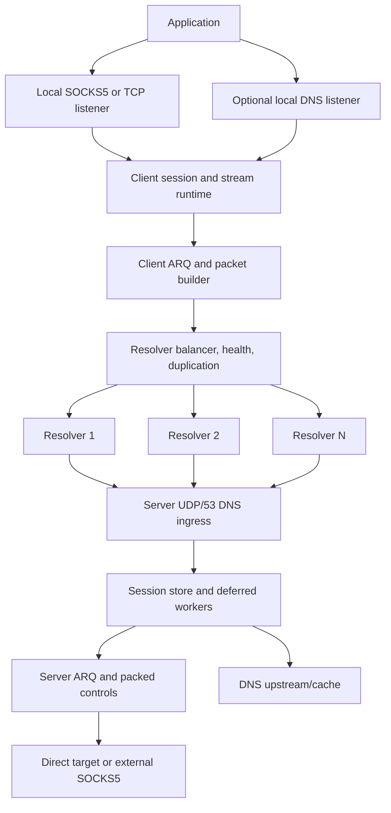
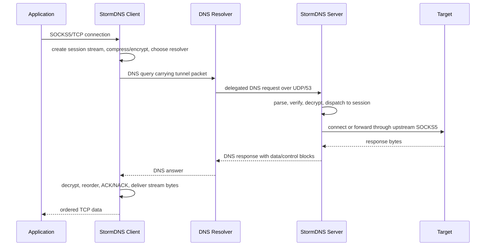

<h1 align="center">⚡ StormDNS</h1>

<p align="center">
  <strong>A DNS-based TCP tunnel for censored, lossy, high-latency networks.</strong>
</p>

<p align="center">
  <a href="LICENSE"></a>
  
  
  
</p>

<p align="center">
  <a href="README_FA.MD">فارسی</a> ·
  <a href="docs/API.md">HTTP API</a> ·
  <a href="https://github.com/nullroute1970/StormDNS/releases/latest">Latest Release</a> ·
  <a href="https://t.me/nulllroute1970">Telegram Channel</a>
</p>

StormDNS is a client/server tunneling system that moves TCP traffic through DNS
queries and DNS responses. The client runs on the user's device and exposes a
local SOCKS5/SOCKS4-style proxy. Applications connect to that local proxy as
they would connect to any normal proxy. StormDNS then splits the stream into
small DNS-safe packets, applies optional compression and encryption, sends the
packets through one or more public DNS resolvers, and reconstructs the stream on
the remote StormDNS server. The server finally opens the real outbound
connection directly, or through an optional upstream SOCKS5 proxy.

The project is built for networks where common circumvention protocols are
blocked, throttled, actively probed, or unreliable, but DNS traffic still has a
usable path. This includes environments with small resolver payload limits, high
latency, unstable resolver behavior, weak upload bandwidth, and frequent packet
loss. StormDNS treats those problems as normal operating conditions: it uses MTU
discovery, resolver health checks, multi-resolver balancing, packet duplication,
ARQ retransmission, ACK/NACK handling, packet packing, and log-based fast
startup to keep the tunnel usable when the network is hostile.

Typical usage is simple: run the server on a VPS with UDP/53 reachable, delegate
a short DNS subdomain to that server, put the generated encryption key and
domain into the client config, add working resolvers, then point your browser or
application at the local SOCKS5 listener. Advanced deployments can enable local
DNS handling, tune resolver/MTU behavior, expose the local HTTP API for
monitoring, or chain server egress through another SOCKS5 proxy.

> [!NOTE]
> DNS tunneling is constrained by resolver payload size, latency, rate limits,
> and packet loss. StormDNS is built for usable connectivity under pressure,
> not for unrealistic benchmark-only claims or replacing a normal VPN on clean,
> high-bandwidth networks.

## 💸 Financial Support

Financial support is optional. If you want to support ongoing development, use
one of these wallet addresses:

| 💰 Network | 🔐 Address |
| --- | --- |
| TON | `UQDfjVk2UdpiMg-bsxqoLa0O_icuaF20D-wWJgIJwK1Ha2Ul` |
| USDT Tron (TRC20) | `TR8ibZGKutPKoDm5nMbHFwGPFBuMKwjG6j` |
| USDT BNB Smart Chain (BEP20) | `0x8c45d6bae8a5a572b2a776779fe0bcae3d3f9107` |

## 🧭 Quick Navigation

| Area | Go To |
| --- | --- |
| 🚀 First deployment | [Quick Server Setup](#quick-server-setup), [Client Setup](#client-setup) |
| 🌐 Domain and resolver requirements | [Network And Domain Requirements](#network-domain-requirements) |
| ⚙️ Configuration | [Configuration Overview](#configuration-overview) |
| 📡 Resolver/MTU tuning | [Resolver And MTU Tuning](#resolver-mtu-tuning) |
| 🧯 Problems and fixes | [Troubleshooting](#troubleshooting) |
| 🧑‍💻 Development | [Running From Source](#running-from-source), [Testing](#testing) |

## 🎯 Built For Hostile Networks

| Network Reality | StormDNS Response |
| --- | --- |
| 📏 DNS payloads are small | Low protocol overhead, DNS-safe encoding, active MTU discovery |
| 📉 Packet loss is normal | ARQ windows, ACK/NACK, retransmission timers, terminal drain handling |
| 📡 Resolvers degrade or disappear | Health checks, auto-disable, background recheck, stream failover |
| ⬆️ Upload is often the bottleneck | Separate duplication controls for upload data, ACKs, setup, and control |
| 🕒 Startup can be expensive | Resolver cache logs and log-based fast startup |

## ✨ Main Capabilities

| Category | Capabilities |
| --- | --- |
| 🌐 Transport | DNS tunnel over UDP/53, multi-domain catalog, multi-resolver routing |
| 🧦 Local access | SOCKS5 proxy mode, SOCKS4-style handling, raw TCP forwarding mode |
| 📡 Resolver runtime | Random, round-robin, least-loss, and lowest-latency balancing |
| 🔁 Reliability | ARQ, ACK/NACK, RTO, retry limits, stream cleanup, packed controls |
| 📦 Efficiency | MTU discovery, packet packing, optional base encoding, ZSTD/LZ4/ZLIB |
| 🔐 Security | None, XOR, ChaCha20, AES-128-GCM, AES-192-GCM, AES-256-GCM |
| 📛 DNS features | Optional local DNS listener/cache and server-side DNS upstream/cache |
| 🔎 Operations | Local HTTP API, Linux systemd installers, cross-platform releases |

## 🗂️ Repository Map

| Path | Purpose |
| --- | --- |
| `cmd/client` | Client executable entrypoint |
| `cmd/server` | Server executable entrypoint |
| `internal/client` | Client runtime, SOCKS/TCP listeners, resolver balancing, MTU, API |
| `internal/udpserver` | Server runtime, DNS ingress, sessions, streams, deferred workers |
| `internal/vpnproto` | StormDNS packet building, parsing, payloads, control packing |
| `internal/arq` | Reliability window, retransmission, ACK/NACK logic |
| `internal/security` | Encryption codecs and server key generation |
| `internal/compression` | ZSTD, LZ4, and ZLIB integration |
| `internal/basecodec` | DNS-safe encoding helpers |
| `internal/config` | TOML configuration loading and CLI override binding |
| `internal/dnsparser` | DNS packet parsing and response creation |
| `docs/API.md` | Local client HTTP API reference |
| `scripts/bench` | Local integration benchmark helper |

<a id="network-domain-requirements"></a>

## 🌐 Network And Domain Requirements

You need:

- A server with a public IPv4 address.
- UDP port `53` reachable from public DNS resolvers.
- A domain or subdomain that you can delegate to your server.
- A client-side resolver list in `client_resolvers.txt`.
- The server-generated encryption key copied into `client_config.toml`.

### 🧩 DNS Delegation

Create one `A` record for the nameserver host and one `NS` record that delegates
the tunnel subdomain to that nameserver.

Example:

```text
ns.example.com  A   1.2.3.4
v.example.com   NS  ns.example.com
```

Use the delegated name, such as `v.example.com`, in both:

```toml
# server_config.toml
DOMAIN = ["v.example.com"]

# client_config.toml
DOMAINS = ["v.example.com"]
```

If your DNS provider is Cloudflare, the `A` record for `ns.example.com` must be
set to **DNS only**. It must not be proxied.

Short domain labels are better. Every character in the query name reduces the
space left for tunnel payload.

<a id="quick-server-setup"></a>

## 🚀 Quick Server Setup On Linux

Run the server installer on the remote Linux server:

```bash
bash <(curl -Ls https://raw.githubusercontent.com/nullroute1970/StormDNS/main/server_linux_install.sh)
```

The installer:

- downloads the correct release artifact unless `--local` is used;
- prepares `server_config.toml`;
- asks for the tunnel domain if the sample value is still present;
- frees port `53` when possible;
- opens firewall rules for port `53`;
- applies UDP/file-descriptor tuning;
- starts the server once to generate `encrypt_key.txt`;
- installs a `stormdns` systemd service;
- installs an egress filter that rejects outbound TCP/53 from the server.

Installer options:

| Option | Description |
| --- | --- |
| `--version <TAG>` | Install a specific release tag instead of latest |
| `--local` | Use a locally built binary/config from the current directory or `dist/` |
| `--uninstall` | Remove the systemd service, tuning files, binary, config, and key from the install directory |
| `--help` | Show installer usage |

Useful service commands:

```bash
systemctl status stormdns
journalctl -u stormdns -f
systemctl restart stormdns
systemctl stop stormdns
```

The server prints the active encryption key during startup and stores it in
`encrypt_key.txt`. Copy that value into the client config.

<a id="client-setup"></a>

## 🧑‍💻 Client Setup

Download a client release for your platform from:

```text
https://github.com/nullroute1970/StormDNS/releases/latest
```

Release archives include:

- the client executable;
- `client_config.toml`;
- `client_resolvers.txt`;
- on Linux, `client_linux_install.sh`.

Minimum client edits:

```toml
DOMAINS = ["v.example.com"]
DATA_ENCRYPTION_METHOD = 1
ENCRYPTION_KEY = "paste-server-key-here"

PROTOCOL_TYPE = "SOCKS5"
LISTEN_IP = "127.0.0.1"
LISTEN_PORT = 18000
```

Add resolvers to `client_resolvers.txt`, one per line:

```text
8.8.8.8
1.1.1.1:53
9.9.9.9
192.0.2.0/30
[2001:4860:4860::8888]:53
```

Run manually:

```bash
./StormDNS_Client_Linux_AMD64 --config client_config.toml
```

Windows example:

```powershell
.\StormDNS_Client_Windows_AMD64.exe --config client_config.toml
```

Then set your browser or application to use:

```text
SOCKS5 127.0.0.1:18000
```

### 🐧 Linux Client Service

From the extracted client release directory:

```bash
sudo bash client_linux_install.sh
```

The service name is `stormdns-client`:

```bash
systemctl status stormdns-client
journalctl -u stormdns-client -f
systemctl restart stormdns-client
```

<a id="running-from-source"></a>

## 🛠️ Running From Source

Requirements:

- Go `1.25` as declared in `go.mod`.
- Git.
- Python only if you want to use `build.py`.

Build the current platform:

```bash
go build ./cmd/client
go build ./cmd/server
```

Run from source-built binaries:

```bash
./client --config client_config.toml
./server --config server_config.toml
```

Build a small local distribution set:

```bash
python build.py
```

The local build script writes binaries and sample configs to `dist/`. The full
GitHub Actions release workflow builds a wider matrix for Windows, Linux,
Linux-Legacy, macOS, and Termux/Android.

<a id="configuration-overview"></a>

## ⚙️ Configuration Overview

StormDNS uses TOML files only. Configuration paths are resolved relative to the
executable by default.

### 🔐 Shared Identity And Security

These values must agree between client and server:

| Setting | Client | Server | Notes |
| --- | --- | --- | --- |
| Tunnel domain | `DOMAINS` | `DOMAIN` | All domains must be delegated to the server |
| Encryption method | `DATA_ENCRYPTION_METHOD` | `DATA_ENCRYPTION_METHOD` | Method IDs must match |
| Key | `ENCRYPTION_KEY` | `ENCRYPTION_KEY_FILE` | Server stores the key in a file |

Encryption method IDs:

| ID | Method |
| --- | --- |
| `0` | None |
| `1` | XOR |
| `2` | ChaCha20 |
| `3` | AES-128-GCM |
| `4` | AES-192-GCM |
| `5` | AES-256-GCM |

Use `0` only for local testing. `1` has low overhead but weak security.
ChaCha20 or AES-GCM are better choices when the path can tolerate the overhead.

### 🖥️ Client Runtime Settings

Important client sections:

| Area | Settings |
| --- | --- |
| Local proxy | `PROTOCOL_TYPE`, `LISTEN_IP`, `LISTEN_PORT`, `SOCKS5_AUTH` |
| Local DNS | `LOCAL_DNS_ENABLED`, `LOCAL_DNS_IP`, `LOCAL_DNS_PORT`, cache settings |
| Resolver choice | `RESOLVER_BALANCING_STRATEGY` |
| Duplication | `UPLOAD_PACKET_DUPLICATION_COUNT`, `DOWNLOAD_PACKET_DUPLICATION_COUNT`, setup duplication settings |
| Health checks | `AUTO_DISABLE_TIMEOUT_SERVERS`, `RECHECK_INACTIVE_SERVERS_ENABLED` |
| Compression | `UPLOAD_COMPRESSION_TYPE`, `DOWNLOAD_COMPRESSION_TYPE`, `COMPRESSION_MIN_SIZE` |
| MTU discovery | `MIN_UPLOAD_MTU`, `MAX_UPLOAD_MTU`, `MIN_DOWNLOAD_MTU`, `MAX_DOWNLOAD_MTU` |
| Startup | `STARTUP_MODE`, `LOG_SCAN_MAX_DAYS`, `LOG_SCAN_MAX_RESOLVERS`, `LOG_BASED_MTU_VERIFY` |
| API | `API_ENABLED`, `API_LISTEN_ADDRESS`, `API_LISTEN_PORT` |

Startup modes:

| Value | Behavior |
| --- | --- |
| `ask` | Ask interactively whether to scan resolvers or use logs |
| `resolvers` | Always scan `client_resolvers.txt` |
| `logs` | Start from resolver cache logs, falling back to a full scan if needed |

### 🧠 Server Runtime Settings

Important server sections:

| Area | Settings |
| --- | --- |
| Domain policy | `DOMAIN`, `PROTOCOL_TYPE`, supported compression lists |
| UDP listener | `UDP_HOST`, `UDP_PORT`, `UDP_READERS`, `DNS_REQUEST_WORKERS` |
| Capacity | `MAX_CONCURRENT_REQUESTS`, `SOCKET_BUFFER_SIZE`, `MAX_PACKET_SIZE` |
| Deferred runtime | `DEFERRED_SESSION_WORKERS`, `DEFERRED_SESSION_QUEUE_LIMIT` |
| Session lifetime | `SESSION_TIMEOUT_SECONDS`, cleanup and retention settings |
| DNS upstream | `DNS_UPSTREAM_SERVERS`, cache and fragment settings |
| Outbound path | `USE_EXTERNAL_SOCKS5`, `FORWARD_IP`, `FORWARD_PORT`, `SOCKS5_AUTH` |
| ARQ | window, RTO, retry, TTL, NACK, and terminal drain settings |
| Stream limits | `MAX_STREAMS_PER_SESSION`, `MAX_DNS_RESPONSE_BYTES` |

<a id="resolver-mtu-tuning"></a>

## 📡 Resolver And MTU Tuning

Resolver choice determines whether StormDNS is usable. A resolver may work for
ordinary DNS but fail for tunnel-sized payloads, long labels, or repeated
queries. Always let the client test your resolver list.

Practical tuning path:

1. Start with the sample configs.
2. Put many candidate resolvers in `client_resolvers.txt`.
3. Run with `STARTUP_MODE = "resolvers"`.
4. Keep `LOG_TO_FILE = true` so good resolver/MTU results are saved.
5. Once you have a good resolver cache, switch to `STARTUP_MODE = "logs"` for
   faster startup.

If startup takes too long, reduce the search range:

```toml
MIN_UPLOAD_MTU = 80
MAX_UPLOAD_MTU = 180
MIN_DOWNLOAD_MTU = 700
MAX_DOWNLOAD_MTU = 2500
```

If many resolvers fail, lower the minimums. If the tunnel is stable but slow,
raise the maximums gradually and retest.

For resolver scanning, use smaller probes and high parallelism:

```toml
STARTUP_MODE = "resolvers"
MIN_UPLOAD_MTU = 30
MAX_UPLOAD_MTU = 30
MIN_DOWNLOAD_MTU = 40
MAX_DOWNLOAD_MTU = 40
MTU_TEST_RETRIES_RESOLVERS = 1
MTU_TEST_TIMEOUT_RESOLVERS = 1.0
MTU_TEST_PARALLELISM_RESOLVERS = 200
```

You still need a working server domain and encryption key before scanning,
because MTU tests exercise the actual tunnel path.

## 📦 Duplication And Compression Guidance

Duplication improves delivery probability but increases DNS query volume.

Common lossy-network profile:

```toml
UPLOAD_PACKET_DUPLICATION_COUNT = 1
DOWNLOAD_PACKET_DUPLICATION_COUNT = 4
UPLOAD_SETUP_PACKET_DUPLICATION_COUNT = 2
DOWNLOAD_SETUP_PACKET_DUPLICATION_COUNT = 4
```

If uploads are extremely weak, keep upload duplication low. Download ACK and
control duplication are usually cheaper because those packets are small.

Compression IDs:

| ID | Method |
| --- | --- |
| `0` | OFF |
| `1` | ZSTD |
| `2` | LZ4 |
| `3` | ZLIB |

LZ4 is a practical default for weak devices and unstable links. ZSTD can reduce
more bytes on compressible traffic but costs more CPU. Compression does not help
already-compressed traffic such as most video, archives, and modern HTTPS
payloads.

## 🔎 Local HTTP API

The client can expose a local API:

```toml
API_ENABLED = true
API_LISTEN_ADDRESS = "127.0.0.1"
API_LISTEN_PORT = 9157
```

Examples:

```bash
curl http://127.0.0.1:9157/api/v1/status
curl http://127.0.0.1:9157/api/v1/resolvers
curl -X POST http://127.0.0.1:9157/api/v1/restart-session
```

The full reference is in [docs/API.md](docs/API.md).

Keep the API on `127.0.0.1` unless you are deliberately exposing it on a trusted
LAN. The API has control endpoints and does not provide authentication.

## 📱 Mobile Usage

There is no official mobile app in this repository.

Usable options:

- Run the client on a computer and set `LISTEN_IP = "0.0.0.0"` so a phone on the
  same LAN can use it as a SOCKS5 proxy.
- Run the client on a small VPS or router and point mobile devices to that
  SOCKS5 listener.
- Chain another local proxy/panel into the StormDNS SOCKS5 listener.

If you bind the client to `0.0.0.0`, enable SOCKS5 authentication:

```toml
SOCKS5_AUTH = true
SOCKS5_USER = "choose-a-user"
SOCKS5_PASS = "choose-a-strong-password"
```

Do not expose an unauthenticated SOCKS5 listener to the internet.

## 🏗️ Architecture



Packet flow:



<a id="troubleshooting"></a>

## 🧯 Troubleshooting

### 🌐 Server does not receive traffic

- Confirm the delegated `NS` record points to your nameserver host.
- Confirm the nameserver host has an `A` record pointing to the server IP.
- Confirm the DNS provider is not proxying the nameserver `A` record.
- Confirm UDP port `53` is open on the server firewall and hosting provider
  firewall.
- Test directly:

```bash
dig v.example.com NS
dig @ns.example.com v.example.com A
```

### 🚧 Port 53 is already in use

On many Linux systems, `systemd-resolved` binds local port `53`. The installer
tries to handle this. Manual fix:

```bash
sudo nano /etc/systemd/resolved.conf
```

Set:

```text
DNSStubListener=no
```

Then:

```bash
sudo systemctl restart systemd-resolved
```

Only one DNS server can listen on the same IP/port at the same time.

### 🕒 Client starts slowly

- Use `STARTUP_MODE = "logs"` after one successful full scan.
- Reduce MTU search ranges.
- Lower `MTU_TEST_RETRIES_RESOLVERS`.
- Remove consistently failing resolvers from `client_resolvers.txt`.

### 🧊 Tunnel connects but websites stall

- Lower upload MTU and download MTU.
- Increase download ACK/control duplication.
- Try `RESOLVER_BALANCING_STRATEGY = 3` for least-loss.
- Use more resolvers from different networks.
- Check client API `/api/v1/resolvers` for timeout-only paths.

### 🧦 SOCKS works locally but not from another device

- Set `LISTEN_IP = "0.0.0.0"`.
- Open the client machine firewall for `LISTEN_PORT`.
- Enable SOCKS5 authentication.
- Use the client machine's LAN IP, not `127.0.0.1`, from the phone or other
  device.

## 🏷️ Release And Artifact Names

Release tags are generated by CI in this form:

```text
vYYYY.MM.DD.HHMMSS-commithash
```

Artifacts follow this pattern:

```text
StormDNS_Client_<Platform>_<ARCH>.zip
StormDNS_Client_<Platform>_<ARCH>.tar.gz
StormDNS_Server_<Platform>_<ARCH>.zip
StormDNS_Server_<Platform>_<ARCH>.tar.gz
```

Supported release platforms include Windows, Linux, Linux-Legacy, MacOS, and
Termux. Supported architectures include common AMD64/x86/ARM variants plus
RISC-V and MIPS Linux targets as defined in
[.github/workflows/build-go.yml](.github/workflows/build-go.yml).

<a id="testing"></a>

## 🧪 Testing

Standard checks:

```bash
go test ./...
go vet ./...
```

Targeted examples:

```bash
go test -v -run TestName ./internal/client
go test -race ./internal/client ./internal/udpserver
```

Benchmark helper:

```bash
go run ./scripts/bench
```

## 🛡️ Security And Responsibility

StormDNS is provided as-is, without warranty. You are responsible for how you
deploy it, which networks you use it on, and whether that usage is legal in your
jurisdiction.

Operational safety notes:

- Keep `encrypt_key.txt` private.
- Do not expose unauthenticated SOCKS5 or API listeners.
- Prefer `127.0.0.1` for local listeners unless LAN access is required.
- Monitor resolver behavior and logs under heavy loss.
- Avoid running unrelated DNS tunnel services on the same server port.

## 🤝 Contributing

Bug reports, focused performance improvements, protocol fixes, tests, and
documentation updates are welcome.

- Issues: <https://github.com/nullroute1970/StormDNS/issues>
- Pull requests: <https://github.com/nullroute1970/StormDNS/pulls>

Before submitting code, run:

```bash
go test ./...
go vet ./...
```

## 📄 License

StormDNS is released under the MIT license. See [LICENSE](LICENSE).

## 👤 Maintainer

Maintained by [nullroute1970](https://github.com/nullroute1970).

Project channel: <https://t.me/nulllroute1970>
