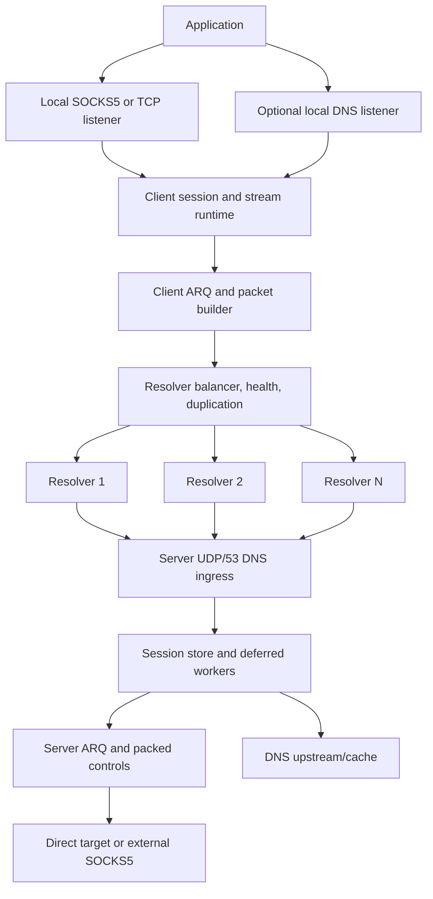
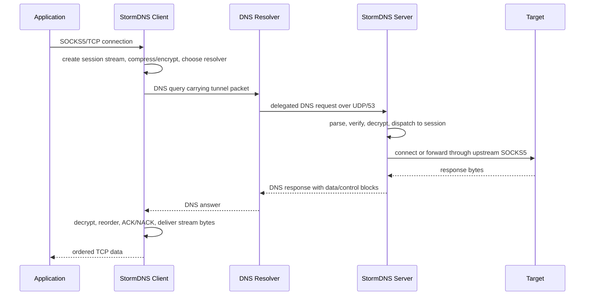

<h1 align="center">⚡ StormDNS</h1>

<p align="center">
  <strong>A DNS-based TCP tunnel for censored, lossy, high-latency networks.</strong>
</p>

<p align="center">
  <a href="LICENSE"></a>
  
  
  
</p>

<p align="center">
  <a href="README_FA.MD">فارسی</a> ·
  <a href="docs/API.md">HTTP API</a> ·
  <a href="https://github.com/nullroute1970/StormDNS/releases/latest">Latest Release</a> ·
  <a href="https://t.me/nulllroute1970">Telegram Channel</a>
</p>

StormDNS is a client/server tunneling system that moves TCP traffic through DNS
queries and DNS responses. The client runs on the user's device and exposes a
local SOCKS5/SOCKS4-style proxy. Applications connect to that local proxy as
they would connect to any normal proxy. StormDNS then splits the stream into
small DNS-safe packets, applies optional compression and encryption, sends the
packets through one or more public DNS resolvers, and reconstructs the stream on
the remote StormDNS server. The server finally opens the real outbound
connection directly, or through an optional upstream SOCKS5 proxy.

The project is built for networks where common circumvention protocols are
blocked, throttled, actively probed, or unreliable, but DNS traffic still has a
usable path. This includes environments with small resolver payload limits, high
latency, unstable resolver behavior, weak upload bandwidth, and frequent packet
loss. StormDNS treats those problems as normal operating conditions: it uses MTU
discovery, resolver health checks, multi-resolver balancing, packet duplication,
ARQ retransmission, ACK/NACK handling, packet packing, and log-based fast
startup to keep the tunnel usable when the network is hostile.

Typical usage is simple: run the server on a VPS with UDP/53 reachable, delegate
a short DNS subdomain to that server, put the generated encryption key and
domain into the client config, add working resolvers, then point your browser or
application at the local SOCKS5 listener. Advanced deployments can enable local
DNS handling, tune resolver/MTU behavior, expose the local HTTP API for
monitoring, or chain server egress through another SOCKS5 proxy.

> [!NOTE]
> DNS tunneling is constrained by resolver payload size, latency, rate limits,
> and packet loss. StormDNS is built for usable connectivity under pressure,
> not for unrealistic benchmark-only claims or replacing a normal VPN on clean,
> high-bandwidth networks.

## 💸 Financial Support

Financial support is optional. If you want to support ongoing development, use
one of these wallet addresses:

| 💰 Network | 🔐 Address |
| --- | --- |
| TON | `UQDfjVk2UdpiMg-bsxqoLa0O_icuaF20D-wWJgIJwK1Ha2Ul` |
| USDT Tron (TRC20) | `TR8ibZGKutPKoDm5nMbHFwGPFBuMKwjG6j` |
| USDT BNB Smart Chain (BEP20) | `0x8c45d6bae8a5a572b2a776779fe0bcae3d3f9107` |

## 🧭 Quick Navigation

| Area | Go To |
| --- | --- |
| 🚀 First deployment | [Quick Server Setup](#quick-server-setup), [Client Setup](#client-setup) |
| 🌐 Domain and resolver requirements | [Network And Domain Requirements](#network-domain-requirements) |
| ⚙️ Configuration | [Configuration Overview](#configuration-overview) |
| 📡 Resolver/MTU tuning | [Resolver And MTU Tuning](#resolver-mtu-tuning) |
| 🧯 Problems and fixes | [Troubleshooting](#troubleshooting) |
| 🧑‍💻 Development | [Running From Source](#running-from-source), [Testing](#testing) |

## 🎯 Built For Hostile Networks

| Network Reality | StormDNS Response |
| --- | --- |
| 📏 DNS payloads are small | Low protocol overhead, DNS-safe encoding, active MTU discovery |
| 📉 Packet loss is normal | ARQ windows, ACK/NACK, retransmission timers, terminal drain handling |
| 📡 Resolvers degrade or disappear | Health checks, auto-disable, background recheck, stream failover |
| ⬆️ Upload is often the bottleneck | Separate duplication controls for upload data, ACKs, setup, and control |
| 🕒 Startup can be expensive | Resolver cache logs and log-based fast startup |

## ✨ Main Capabilities

| Category | Capabilities |
| --- | --- |
| 🌐 Transport | DNS tunnel over UDP/53, multi-domain catalog, multi-resolver routing |
| 🧦 Local access | SOCKS5 proxy mode, SOCKS4-style handling, raw TCP forwarding mode |
| 📡 Resolver runtime | Random, round-robin, least-loss, and lowest-latency balancing |
| 🔁 Reliability | ARQ, ACK/NACK, RTO, retry limits, stream cleanup, packed controls |
| 📦 Efficiency | MTU discovery, packet packing, optional base encoding, ZSTD/LZ4/ZLIB |
| 🔐 Security | None, XOR, ChaCha20, AES-128-GCM, AES-192-GCM, AES-256-GCM |
| 📛 DNS features | Optional local DNS listener/cache and server-side DNS upstream/cache |
| 🔎 Operations | Local HTTP API, Linux systemd installers, cross-platform releases |

## 🗂️ Repository Map

| Path | Purpose |
| --- | --- |
| `cmd/client` | Client executable entrypoint |
| `cmd/server` | Server executable entrypoint |
| `internal/client` | Client runtime, SOCKS/TCP listeners, resolver balancing, MTU, API |
| `internal/udpserver` | Server runtime, DNS ingress, sessions, streams, deferred workers |
| `internal/vpnproto` | StormDNS packet building, parsing, payloads, control packing |
| `internal/arq` | Reliability window, retransmission, ACK/NACK logic |
| `internal/security` | Encryption codecs and server key generation |
| `internal/compression` | ZSTD, LZ4, and ZLIB integration |
| `internal/basecodec` | DNS-safe encoding helpers |
| `internal/config` | TOML configuration loading and CLI override binding |
| `internal/dnsparser` | DNS packet parsing and response creation |
| `docs/API.md` | Local client HTTP API reference |
| `scripts/bench` | Local integration benchmark helper |

<a id="network-domain-requirements"></a>

## 🌐 Network And Domain Requirements

You need:

- A server with a public IPv4 address.
- UDP port `53` reachable from public DNS resolvers.
- A domain or subdomain that you can delegate to your server.
- A client-side resolver list in `client_resolvers.txt`.
- The server-generated encryption key copied into `client_config.toml`.

### 🧩 DNS Delegation

Create one `A` record for the nameserver host and one `NS` record that delegates
the tunnel subdomain to that nameserver.

Example:

```text
ns.example.com  A   1.2.3.4
v.example.com   NS  ns.example.com
```

Use the delegated name, such as `v.example.com`, in both:

```toml
# server_config.toml
DOMAIN = ["v.example.com"]

# client_config.toml
DOMAINS = ["v.example.com"]
```

If your DNS provider is Cloudflare, the `A` record for `ns.example.com` must be
set to **DNS only**. It must not be proxied.

Short domain labels are better. Every character in the query name reduces the
space left for tunnel payload.

<a id="quick-server-setup"></a>

## 🚀 Quick Server Setup On Linux

Run the server installer on the remote Linux server:

```bash
bash <(curl -Ls https://raw.githubusercontent.com/nullroute1970/StormDNS/main/server_linux_install.sh)
```

The installer:

- downloads the correct release artifact unless `--local` is used;
- prepares `server_config.toml`;
- asks for the tunnel domain if the sample value is still present;
- frees port `53` when possible;
- opens firewall rules for port `53`;
- applies UDP/file-descriptor tuning;
- starts the server once to generate `encrypt_key.txt`;
- installs a `stormdns` systemd service;
- installs an egress filter that rejects outbound TCP/53 from the server.

Installer options:

| Option | Description |
| --- | --- |
| `--version <TAG>` | Install a specific release tag instead of latest |
| `--local` | Use a locally built binary/config from the current directory or `dist/` |
| `--uninstall` | Remove the systemd service, tuning files, binary, config, and key from the install directory |
| `--help` | Show installer usage |

Install a specific release tag with `--version`:

```bash
bash <(curl -Ls https://raw.githubusercontent.com/nullroute1970/StormDNS/main/server_linux_install.sh) --version vYYYY.MM.DD.HHMMSS-commithash
```

Use the exact tag shown on the
[GitHub releases page](https://github.com/nullroute1970/StormDNS/releases).
Release tags normally use the `vYYYY.MM.DD.HHMMSS-commithash` format; replace
the placeholder with a real tag before running the command.

Uninstall the server service and files with `--uninstall`:

```bash
bash <(curl -Ls https://raw.githubusercontent.com/nullroute1970/StormDNS/main/server_linux_install.sh) --uninstall
```

`--version` cannot be combined with `--local` or `--uninstall`.

Useful service commands:

```bash
systemctl status stormdns
journalctl -u stormdns -f
systemctl restart stormdns
systemctl stop stormdns
```

The server prints the active encryption key during startup and stores it in
`encrypt_key.txt`. Copy that value into the client config.

<a id="client-setup"></a>

## 🧑‍💻 Client Setup

Download a client release for your platform from:

```text
https://github.com/nullroute1970/StormDNS/releases/latest
```

Release archives include:

- the client executable;
- `client_config.toml`;
- `client_resolvers.txt`;
- on Linux, `client_linux_install.sh`.

Minimum client edits:

```toml
DOMAINS = ["v.example.com"]
DATA_ENCRYPTION_METHOD = 1
ENCRYPTION_KEY = "paste-server-key-here"

PROTOCOL_TYPE = "SOCKS5"
LISTEN_IP = "127.0.0.1"
LISTEN_PORT = 18000
```

Add resolvers to `client_resolvers.txt`, one per line:

```text
8.8.8.8
1.1.1.1:53
9.9.9.9
192.0.2.0/30
[2001:4860:4860::8888]:53
```

Run manually:

```bash
./StormDNS_Client_Linux_AMD64 --config client_config.toml
```

Windows example:

```powershell
.\StormDNS_Client_Windows_AMD64.exe --config client_config.toml
```

Then set your browser or application to use:

```text
SOCKS5 127.0.0.1:18000
```

### 🐧 Linux Client Service

From the extracted client release directory:

```bash
sudo bash client_linux_install.sh
```

The service name is `stormdns-client`:

```bash
systemctl status stormdns-client
journalctl -u stormdns-client -f
systemctl restart stormdns-client
```

<a id="running-from-source"></a>

## 🛠️ Running From Source

Requirements:

- Go `1.25` as declared in `go.mod`.
- Git.
- Python only if you want to use `build.py`.

Build the current platform:

```bash
go build ./cmd/client
go build ./cmd/server
```

Run from source-built binaries:

```bash
./client --config client_config.toml
./server --config server_config.toml
```

Build a small local distribution set:

```bash
python build.py
```

The local build script writes binaries and sample configs to `dist/`. The full
GitHub Actions release workflow builds a wider matrix for Windows, Linux,
Linux-Legacy, macOS, and Termux/Android.

<a id="configuration-overview"></a>

## ⚙️ Configuration Overview

StormDNS uses TOML files only. Configuration paths are resolved relative to the
executable by default.

### 🔐 Shared Identity And Security

These values must agree between client and server:

| Setting | Client | Server | Notes |
| --- | --- | --- | --- |
| Tunnel domain | `DOMAINS` | `DOMAIN` | All domains must be delegated to the server |
| Encryption method | `DATA_ENCRYPTION_METHOD` | `DATA_ENCRYPTION_METHOD` | Method IDs must match |
| Key | `ENCRYPTION_KEY` | `ENCRYPTION_KEY_FILE` | Server stores the key in a file |

Encryption method IDs:

| ID | Method |
| --- | --- |
| `0` | None |
| `1` | XOR |
| `2` | ChaCha20 |
| `3` | AES-128-GCM |
| `4` | AES-192-GCM |
| `5` | AES-256-GCM |

Use `0` only for local testing. `1` has low overhead but weak security.
ChaCha20 or AES-GCM are better choices when the path can tolerate the overhead.

### 🖥️ Client Runtime Settings

Important client sections:

| Area | Settings |
| --- | --- |
| Local proxy | `PROTOCOL_TYPE`, `LISTEN_IP`, `LISTEN_PORT`, `SOCKS5_AUTH` |
| Local DNS | `LOCAL_DNS_ENABLED`, `LOCAL_DNS_IP`, `LOCAL_DNS_PORT`, cache settings |
| Resolver choice | `RESOLVER_BALANCING_STRATEGY` |
| Duplication | `UPLOAD_PACKET_DUPLICATION_COUNT`, `DOWNLOAD_PACKET_DUPLICATION_COUNT`, setup duplication settings |
| Health checks | `AUTO_DISABLE_TIMEOUT_SERVERS`, `RECHECK_INACTIVE_SERVERS_ENABLED` |
| Compression | `UPLOAD_COMPRESSION_TYPE`, `DOWNLOAD_COMPRESSION_TYPE`, `COMPRESSION_MIN_SIZE` |
| MTU discovery | `MIN_UPLOAD_MTU`, `MAX_UPLOAD_MTU`, `MIN_DOWNLOAD_MTU`, `MAX_DOWNLOAD_MTU` |
| Startup | `STARTUP_MODE`, `LOG_SCAN_MAX_DAYS`, `LOG_SCAN_MAX_RESOLVERS`, `LOG_BASED_MTU_VERIFY` |
| API | `API_ENABLED`, `API_LISTEN_ADDRESS`, `API_LISTEN_PORT` |

Startup modes:

| Value | Behavior |
| --- | --- |
| `ask` | Ask interactively whether to scan resolvers or use logs |
| `resolvers` | Always scan `client_resolvers.txt` |
| `logs` | Start from resolver cache logs, falling back to a full scan if needed |

### 🧠 Server Runtime Settings

Important server sections:

| Area | Settings |
| --- | --- |
| Domain policy | `DOMAIN`, `PROTOCOL_TYPE`, supported compression lists |
| UDP listener | `UDP_HOST`, `UDP_PORT`, `UDP_READERS`, `DNS_REQUEST_WORKERS` |
| Capacity | `MAX_CONCURRENT_REQUESTS`, `SOCKET_BUFFER_SIZE`, `MAX_PACKET_SIZE` |
| Deferred runtime | `DEFERRED_SESSION_WORKERS`, `DEFERRED_SESSION_QUEUE_LIMIT` |
| Session lifetime | `SESSION_TIMEOUT_SECONDS`, cleanup and retention settings |
| DNS upstream | `DNS_UPSTREAM_SERVERS`, cache and fragment settings |
| Outbound path | `USE_EXTERNAL_SOCKS5`, `FORWARD_IP`, `FORWARD_PORT`, `SOCKS5_AUTH` |
| ARQ | window, RTO, retry, TTL, NACK, and terminal drain settings |
| Stream limits | `MAX_STREAMS_PER_SESSION`, `MAX_DNS_RESPONSE_BYTES` |

### 📘 Complete Client Config Reference

The client sample file is `client_config.toml.simple`. Every key in that file is
listed below.

#### Tunnel Identity And Security

| Setting | Description | Notes |
| --- | --- | --- |
| `DOMAINS` | Tunnel domains used when building DNS query names. | Must contain at least one delegated domain and must match the server `DOMAIN` list. Shorter domains leave more room for payload. |
| `DATA_ENCRYPTION_METHOD` | Payload encryption method ID. | Must match the server. `0` disables encryption; `1` is XOR; `2` is ChaCha20; `3`/`4`/`5` are AES-128/192/256-GCM. |
| `ENCRYPTION_KEY` | Shared client-side encryption key. | Required. Paste the value generated by the server key file. Whitespace is trimmed. |

#### Local Proxy Listener

| Setting | Description | Notes |
| --- | --- | --- |
| `PROTOCOL_TYPE` | Local client mode. | `SOCKS5` exposes a normal local proxy. `TCP` exposes a raw TCP tunnel mode. |
| `LISTEN_IP` | Local bind address for the proxy listener. | Use `127.0.0.1` for local-only access, `localhost` when apps prefer hostname resolution, or `0.0.0.0` only when LAN devices must connect. |
| `LISTEN_PORT` | Local TCP port for the proxy listener. | Must be `0..65535` and must not conflict with the API or local DNS listener. |
| `SOCKS5_AUTH` | Enables username/password authentication on the local SOCKS5 listener. | Protects only the local proxy, not the remote tunnel. Strongly recommended when binding outside localhost. |
| `SOCKS5_USER` | Local SOCKS5 username. | Required when `SOCKS5_AUTH = true`; maximum 255 bytes. |
| `SOCKS5_PASS` | Local SOCKS5 password. | Maximum 255 bytes. Use a real secret if the listener is reachable by other devices. |

#### Local DNS Service

| Setting | Description | Notes |
| --- | --- | --- |
| `LOCAL_DNS_ENABLED` | Starts the optional local DNS listener. | When true, the client can accept local DNS requests and tunnel them to the server. |
| `LOCAL_DNS_IP` | Bind address for the local DNS listener. | Defaults to `127.0.0.1` when empty. |
| `LOCAL_DNS_PORT` | UDP port for the local DNS listener. | Must be `0..65535`; port `53` may require elevated privileges. |
| `LOCAL_DNS_CACHE_MAX_RECORDS` | Maximum records in the local DNS cache. | Values below `1` fall back to a safe default; larger values use more memory. |
| `LOCAL_DNS_CACHE_TTL_SECONDS` | TTL applied to local DNS cache entries. | Values `<= 0` fall back to the default. |
| `LOCAL_DNS_PENDING_TIMEOUT_SECONDS` | Maximum time a local DNS request may remain pending. | Expired requests are failed locally instead of waiting forever for tunnel response fragments. |
| `DNS_RESPONSE_FRAGMENT_TIMEOUT_SECONDS` | Fragment assembly timeout for DNS responses received through the tunnel. | Clamped to `1..600` seconds. |
| `LOCAL_DNS_CACHE_PERSIST_TO_FILE` | Persists the local DNS cache beside the config. | Uses `local_dns_cache.bin` under the config directory. |
| `LOCAL_DNS_CACHE_FLUSH_INTERVAL_SECONDS` | Disk flush interval for the persisted DNS cache. | Values `<= 0` fall back to the default. |

#### Resolver Selection, Duplication, And Health

| Setting | Description | Notes |
| --- | --- | --- |
| `RESOLVER_BALANCING_STRATEGY` | Chooses how client resolvers are selected. | `1` random, `2` round-robin, `3` least loss, `4` lowest latency. Modes `3` and `4` use runtime feedback. |
| `UPLOAD_PACKET_DUPLICATION_COUNT` | Duplicate count for upload data packets. | Applies to bulk `STREAM_DATA` and resend traffic. Clamped to `1..8`; higher values cost upload bandwidth. |
| `DOWNLOAD_PACKET_DUPLICATION_COUNT` | Duplicate count for download ACK/NACK packets. | These packets are small, so higher values can improve download reliability with less upload cost. Clamped to `1..8`. |
| `UPLOAD_SETUP_PACKET_DUPLICATION_COUNT` | Duplicate count for upload setup packets. | Applies to `STREAM_SYN` and `SOCKS5_SYN`. Clamped to at least upload-data duplication and at most `8`. |
| `DOWNLOAD_SETUP_PACKET_DUPLICATION_COUNT` | Duplicate count for download setup/control packets. | Applies to packed controls and stream close packets. Clamped to at least download ACK duplication and at most `8`. |
| `STREAM_RESOLVER_FAILOVER_RESEND_THRESHOLD` | Resend threshold before a stream can switch preferred resolver. | Clamped to `1..128`. Lower values react faster to resolver failure. |
| `STREAM_RESOLVER_FAILOVER_COOLDOWN` | Minimum seconds between preferred-resolver switches for a stream. | Clamped to `0.1..120` seconds. |
| `RECHECK_INACTIVE_SERVERS_ENABLED` | Rechecks resolvers that failed initial MTU testing. | Uses the current synchronized MTU values in the background. |
| `RECHECK_INACTIVE_INTERVAL_SECONDS` | Full inactive-resolver recheck cycle interval. | Clamped to `60..86400` seconds by code, so very small values are raised. |
| `RECHECK_SERVER_INTERVAL_SECONDS` | Delay between individual resolver rechecks. | Clamped to `1..600` seconds. |
| `RECHECK_BATCH_SIZE` | Number of inactive/runtime-disabled resolvers tested per cycle. | Clamped to `1..1024`. |
| `AUTO_DISABLE_TIMEOUT_SERVERS` | Runtime-disables resolvers that remain timeout-only. | Keeps bad resolvers from absorbing traffic after enough observations. |
| `AUTO_DISABLE_TIMEOUT_WINDOW_SECONDS` | Observation window for timeout-only auto-disable. | Clamped to `1..86400` seconds. |
| `AUTO_DISABLE_MIN_OBSERVATIONS` | Minimum observations before auto-disable can trigger. | Clamped to `1..10000`. |
| `AUTO_DISABLE_CHECK_INTERVAL_SECONDS` | Frequency of auto-disable evaluation. | Clamped to `0.25..600` seconds. |
| `BASE_ENCODE_DATA` | Base-encodes payload labels before tunneling. | Usually keep `false`; enable only for resolver paths that behave better with stricter label characters. |

#### Compression And MTU Discovery

| Setting | Description | Notes |
| --- | --- | --- |
| `UPLOAD_COMPRESSION_TYPE` | Compression requested for client-to-server payloads. | `0` off, `1` ZSTD, `2` LZ4, `3` ZLIB. Server must allow the selected type. |
| `DOWNLOAD_COMPRESSION_TYPE` | Compression requested for server-to-client payloads. | Same IDs as upload compression. |
| `COMPRESSION_MIN_SIZE` | Minimum payload size before compression is attempted. | Values below `1` fall back to the compression package default. |
| `MIN_UPLOAD_MTU` | Minimum accepted upload MTU after resolver testing. | Use lower values when many resolvers fail; `0` effectively disables the lower bound. |
| `MIN_DOWNLOAD_MTU` | Minimum accepted download MTU after resolver testing. | Higher values improve efficiency but reject more resolver paths. |
| `MAX_UPLOAD_MTU` | Upper bound for upload MTU search. | Must be at least the upload minimum when both are set. |
| `MAX_DOWNLOAD_MTU` | Upper bound for download MTU search. | Must be at least the download minimum when both are set. |
| `MTU_TEST_RETRIES_RESOLVERS` | Retry count for full resolver-file MTU scans. | Must be at least `1`; use smaller values for fast discovery and larger values for noisy links. |
| `MTU_TEST_TIMEOUT_RESOLVERS` | Per-probe timeout for full resolver-file MTU scans. | Seconds. Larger values help high-latency resolvers but slow startup. |
| `MTU_TEST_PARALLELISM_RESOLVERS` | Parallel MTU probes during full resolver-file scans. | Must be at least `1`; high values speed scans but increase burst traffic. |
| `MTU_TEST_RETRIES_LOGS` | Retry count when starting from resolver cache logs. | Used only when active startup mode is `logs`. |
| `MTU_TEST_TIMEOUT_LOGS` | Per-probe timeout for log-based MTU verification. | Used when `LOG_BASED_MTU_VERIFY = true`. |
| `MTU_TEST_PARALLELISM_LOGS` | Parallelism for log-based MTU verification. | Usually lower than full scans because the resolver set is already filtered. |

#### Runtime Workers, Queues, And Timers

| Setting | Description | Notes |
| --- | --- | --- |
| `RX_TX_WORKERS` | Async tunnel receive/transmit worker count. | Must be at least `1`; legacy reader/writer worker keys only matter when this key is omitted. |
| `TUNNEL_PROCESS_WORKERS` | Packet-processing worker count. | Must be at least `1`; increasing it can help busy clients but costs CPU. |
| `TUNNEL_PACKET_TIMEOUT_SECONDS` | Per-packet timeout in async runtime paths. | Clamped to `0.5..120` seconds. |
| `DISPATCHER_IDLE_POLL_INTERVAL_SECONDS` | Dispatcher idle polling interval. | Clamped to `0.001..1`; lower values reduce wake latency and increase CPU use. |
| `TX_CHANNEL_SIZE` | Transmit pipeline channel capacity. | Clamped to `64..65536`. |
| `RX_CHANNEL_SIZE` | Receive pipeline channel capacity. | Clamped to `64..65536`. |
| `RESOLVER_UDP_CONNECTION_POOL_SIZE` | UDP socket pool size per resolver key. | Clamped to `1..1024`. |
| `STREAM_QUEUE_INITIAL_CAPACITY` | Initial per-stream queue capacity. | Reduces reallocations when many streams are active. |
| `ORPHAN_QUEUE_INITIAL_CAPACITY` | Initial orphan-packet queue capacity. | Buffers packets that arrive before their owning stream/session is ready. |
| `DNS_RESPONSE_FRAGMENT_STORE_CAPACITY` | Initial local DNS response fragment store capacity. | Clamped by code and affects fragmented DNS-over-tunnel responses. |
| `SOCKS_UDP_ASSOCIATE_READ_TIMEOUT_SECONDS` | Read timeout for local SOCKS UDP ASSOCIATE handling. | Clamped to `1..3600` seconds. |
| `CLIENT_TERMINAL_STREAM_RETENTION_SECONDS` | Retention time for terminal streams before cleanup. | Clamped to `1..3600` seconds. |
| `CLIENT_CANCELLED_SETUP_RETENTION_SECONDS` | Retention time for cancelled setup streams. | Clamped to `1..3600` seconds. |
| `SESSION_INIT_RETRY_BASE_SECONDS` | Initial delay after failed session init/reset. | Clamped to `0.1..60` seconds. |
| `SESSION_INIT_RETRY_STEP_SECONDS` | Increment added to session-init retry delay. | Clamped to `0..60` seconds. |
| `SESSION_INIT_RETRY_LINEAR_AFTER` | Retry count after which delay growth becomes linear. | Clamped to `0..1000`. |
| `SESSION_INIT_RETRY_MAX_SECONDS` | Maximum session-init retry delay. | Clamped to at least the base delay and at most `3600` seconds. |
| `SESSION_INIT_BUSY_RETRY_INTERVAL_SECONDS` | Delay after the server returns `SESSION_BUSY`. | Clamped to `1..3600` seconds. |
| `PING_AGGRESSIVE_INTERVAL_SECONDS` | Keepalive interval during the most active state. | Used immediately after recent non-ping traffic. |
| `PING_LAZY_INTERVAL_SECONDS` | Keepalive interval for warm but less active sessions. | Balances responsiveness and query volume. |
| `PING_COOLDOWN_INTERVAL_SECONDS` | Keepalive interval as activity cools down. | Used before the fully cold interval. |
| `PING_COLD_INTERVAL_SECONDS` | Keepalive interval for cold sessions. | Keeps idle sessions alive with lower query volume. |
| `PING_WARM_THRESHOLD_SECONDS` | Recent-activity threshold for warm ping behavior. | Compared against recent traffic timestamps. |
| `PING_COOL_THRESHOLD_SECONDS` | Threshold for cooldown ping behavior. | Larger than the warm threshold in normal configs. |
| `PING_COLD_THRESHOLD_SECONDS` | Threshold for cold ping behavior. | Larger than the cool threshold in normal configs. |
| `PING_WATCHDOG_TIMEOUT_SECONDS` | Restarts the session if active sends receive no server response. | Clamped to `10..3600`; set `0` to disable the watchdog. |

#### ARQ Reliability And Packing

| Setting | Description | Notes |
| --- | --- | --- |
| `MAX_PACKETS_PER_BATCH` | Maximum control blocks packed into one outgoing batch. | Clamped to `1..64`. |
| `ARQ_WINDOW_SIZE` | Per-stream ARQ send window. | Larger windows improve throughput on high-BDP paths but use more memory. |
| `ARQ_INITIAL_RTO_SECONDS` | Initial data retransmission timeout. | Clamped by code; should be below `ARQ_MAX_RTO_SECONDS`. |
| `ARQ_MAX_RTO_SECONDS` | Maximum data retransmission timeout. | Must be at least the initial data RTO after normalization. |
| `ARQ_CONTROL_INITIAL_RTO_SECONDS` | Initial control-packet retransmission timeout. | Control packets cover setup, ACK/NACK, close, and similar reliability traffic. |
| `ARQ_CONTROL_MAX_RTO_SECONDS` | Maximum control-packet retransmission timeout. | Must be at least the initial control RTO after normalization. |
| `ARQ_MAX_CONTROL_RETRIES` | Maximum control-packet retransmission attempts. | Higher values keep setup/close traffic alive longer on lossy links. |
| `ARQ_INACTIVITY_TIMEOUT_SECONDS` | Inactivity timeout for ARQ stream state. | Prevents dead streams from living forever. |
| `ARQ_DATA_PACKET_TTL_SECONDS` | Lifetime of retained data packets for possible resend. | Should exceed normal retransmission periods on high-latency paths. |
| `ARQ_CONTROL_PACKET_TTL_SECONDS` | Lifetime of retained control packets for possible resend. | Usually shorter than data TTL. |
| `ARQ_MAX_DATA_RETRIES` | Maximum data-packet retransmission attempts. | Higher values tolerate long outages but retain state longer. |
| `ARQ_DATA_NACK_MAX_GAP` | Maximum out-of-order receive gap that can trigger a data NACK. | `0` disables NACK generation; keep small to request only near-miss resends. |
| `ARQ_DATA_NACK_INITIAL_DELAY_SECONDS` | Delay before first NACK for a missing sequence. | Clamped to `0.1..30` seconds. |
| `ARQ_DATA_NACK_REPEAT_SECONDS` | Minimum interval between repeated NACKs for the same sequence. | Clamped to `0.1..30` seconds. |
| `ARQ_TERMINAL_DRAIN_TIMEOUT_SECONDS` | Time allowed for terminal stream drain. | Lets final data and close/ACK state settle before cleanup. |
| `ARQ_TERMINAL_ACK_WAIT_TIMEOUT_SECONDS` | Time terminal streams wait for final acknowledgements. | Prevents close paths from waiting forever. |

#### Logging, Startup, API, And Metadata

| Setting | Description | Notes |
| --- | --- | --- |
| `LOG_LEVEL` | Console/file log verbosity. | Typical values are `DEBUG`, `INFO`, `WARN`, and `ERROR`. |
| `LOG_TO_FILE` | Enables session logs and resolver-cache logs. | Resolver-cache logs are used by log-based startup. |
| `LOG_DIR` | Directory for log files. | Relative paths are resolved from the config directory. |
| `LOG_FILE_NAME` | Session log filename template. | `{time}` expands to the startup timestamp. |
| `STATS_REPORT_INTERVAL_SECONDS` | Interval for speed and cumulative traffic reports. | `0` disables the stats reporter; positive values are clamped to `1..3600`. |
| `STARTUP_MODE` | Chooses resolver startup path. | `ask`, `resolvers`, or `logs`; invalid values fall back to `ask`. |
| `LOG_SCAN_MAX_DAYS` | Maximum age of resolver-cache logs considered during log startup. | `0` means no age limit; negative values become `0`. |
| `LOG_SCAN_MAX_RESOLVERS` | Maximum resolvers loaded from cache logs. | `0` means use all found resolvers; negative values become `0`. |
| `LOG_BASED_MTU_VERIFY` | Runs MTU verification even when starting from logs. | `false` is fastest; `true` confirms cached resolvers still work. |
| `API_ENABLED` | Enables the local HTTP API. | See [HTTP API](docs/API.md). |
| `API_LISTEN_ADDRESS` | Bind address for the local HTTP API. | Keep `127.0.0.1` unless LAN access is intentionally required. |
| `API_LISTEN_PORT` | TCP port for the local HTTP API. | Must be `0..65535` and cannot conflict with `LISTEN_PORT` or enabled `LOCAL_DNS_PORT`. |
| `CONFIG_VERSION` | Sample config version marker. | Kept for humans/installers; unknown TOML fields are ignored by the current Go config loader. |

### 📗 Complete Server Config Reference

The server sample file is `server_config.toml.simple`. Every key in that file is
listed below.

#### Tunnel Policy

| Setting | Description | Notes |
| --- | --- | --- |
| `DOMAIN` | Tunnel domains handled by the server. | Must match the client `DOMAINS` list and point to this server through DNS delegation. |
| `PROTOCOL_TYPE` | Server outbound mode. | `SOCKS5` uses the destination requested by the client; `TCP` forwards every stream to `FORWARD_IP:FORWARD_PORT`. |
| `SUPPORTED_UPLOAD_COMPRESSION_TYPES` | Upload compression methods the server accepts from clients. | Values use compression IDs `0..3`; unsupported, duplicate, or unavailable methods are removed. |
| `SUPPORTED_DOWNLOAD_COMPRESSION_TYPES` | Download compression methods the server accepts from clients. | Include `0` to allow uncompressed traffic. Empty/invalid lists normalize to `[0]`. |

#### UDP Listener And Front-Door Capacity

| Setting | Description | Notes |
| --- | --- | --- |
| `UDP_HOST` | UDP bind address for DNS tunnel ingress. | Defaults to `0.0.0.0` when empty. |
| `UDP_PORT` | UDP bind port for DNS tunnel ingress. | Must be `1..65535`; public deployments normally use `53`. |
| `UDP_READERS` | Number of UDP reader goroutines. | Values `<= 0` use an auto default with minimum `4` and cap `8`. |
| `DNS_REQUEST_WORKERS` | Number of workers processing parsed DNS requests. | Values `<= 0` use an auto default with minimum `8` and cap `32`. |
| `MAX_CONCURRENT_REQUESTS` | Queue size in front of DNS request workers. | Full queues drop packets and emit rate-limited overload logs. |
| `SOCKET_BUFFER_SIZE` | UDP socket read/write buffer size in bytes. | Larger buffers absorb bursts, subject to OS limits. |
| `MAX_PACKET_SIZE` | Maximum packet buffer size allocated by the server pool. | Values `<= 0` fall back to `65535`. |
| `DROP_LOG_INTERVAL_SECONDS` | Minimum interval between overload/drop logs. | Values `<= 0` fall back to `2` seconds. |

#### Deferred Runtime And Stream Capacity

| Setting | Description | Notes |
| --- | --- | --- |
| `DEFERRED_SESSION_WORKERS` | Worker count for deferred per-session processing. | Clamped to `0..128`; `0` disables the worker pool. |
| `DEFERRED_SESSION_QUEUE_LIMIT` | Queue limit for deferred per-session work. | Clamped to `256..14336`. |
| `SESSION_ORPHAN_QUEUE_INITIAL_CAPACITY` | Initial capacity for session orphan queues. | Clamped to `4..4096`. |
| `STREAM_QUEUE_INITIAL_CAPACITY` | Initial capacity for per-stream queues. | Clamped to `8..65536`. |
| `DNS_FRAGMENT_STORE_CAPACITY` | Initial capacity for inbound DNS query fragment assembly. | Clamped to `16..16384`. |
| `SOCKS5_FRAGMENT_STORE_CAPACITY` | Initial capacity for SOCKS5 setup fragment assembly. | Clamped to `16..16384`. |
| `MAX_STREAMS_PER_SESSION` | Maximum concurrently open data streams per session. | Clamped to `16..65535`; control stream `0` is not counted. |
| `MAX_DNS_RESPONSE_BYTES` | Maximum upstream DNS response size that can be fragmented back to the client. | Clamped to `512..65535`; larger responses are dropped before fragmentation. |

#### Session Lifecycle And Invalid Cookies

| Setting | Description | Notes |
| --- | --- | --- |
| `INVALID_COOKIE_WINDOW_SECONDS` | Sliding window for invalid-cookie tracking. | Values `<= 0` fall back to `2` seconds. |
| `INVALID_COOKIE_ERROR_THRESHOLD` | Invalid-cookie hits tolerated inside the window. | Values `<= 0` fall back to `10`; crossing the threshold escalates error behavior. |
| `SESSION_TIMEOUT_SECONDS` | Session inactivity timeout. | Values `<= 0` fall back to `300` seconds. |
| `SESSION_CLEANUP_INTERVAL_SECONDS` | Background session cleanup interval. | Values `<= 0` fall back to `10` seconds. |
| `CLOSED_SESSION_RETENTION_SECONDS` | Retention time for closed-session metadata. | Values `<= 0` fall back to `600` seconds. |
| `SESSION_INIT_REUSE_TTL_SECONDS` | Time an accepted session-init signature can be reused. | Clamped to `1..86400` seconds. |
| `RECENTLY_CLOSED_STREAM_TTL_SECONDS` | Time closed stream IDs remain in the recently-closed table. | Clamped to `1..86400` seconds. |
| `RECENTLY_CLOSED_STREAM_CAP` | Maximum recently-closed stream records per session. | Clamped to `1..1000000`. |
| `TERMINAL_STREAM_RETENTION_SECONDS` | Retention time for terminal streams before sweep cleanup. | Clamped to `1..86400` seconds. |

#### DNS Tunnel Upstream

| Setting | Description | Notes |
| --- | --- | --- |
| `DNS_UPSTREAM_SERVERS` | Upstream DNS resolvers used for tunneled DNS requests. | Values should include host and port, such as `1.1.1.1:53`. Empty lists fall back to `1.1.1.1:53`. |
| `DNS_UPSTREAM_TIMEOUT` | Timeout for each upstream DNS exchange attempt. | Values `<= 0` fall back to `4` seconds. |
| `DNS_INFLIGHT_WAIT_TIMEOUT_SECONDS` | Wait timeout for duplicate DNS requests sharing an inflight lookup. | Clamped to `0.1..120` seconds. |
| `DNS_FRAGMENT_ASSEMBLY_TIMEOUT` | Timeout for assembling inbound tunneled DNS query fragments. | Values `<= 0` fall back to `300` seconds. |
| `DNS_CACHE_MAX_RECORDS` | Maximum records in the server-side tunneled DNS cache. | Values below `1` fall back to a safe default. |
| `DNS_CACHE_TTL_SECONDS` | TTL for server-side tunneled DNS cache entries. | Values `<= 0` fall back to `3600` seconds. |

#### Outbound Path And Security

| Setting | Description | Notes |
| --- | --- | --- |
| `SOCKS_CONNECT_TIMEOUT` | Timeout for outbound TCP connect attempts. | Applies to direct connections and upstream SOCKS setup; values `<= 0` fall back to `8` seconds, and deferred connect attempts are capped at `15` seconds. |
| `USE_EXTERNAL_SOCKS5` | Routes SOCKS5-mode egress through another SOCKS5 proxy. | Requires `FORWARD_IP` and a positive `FORWARD_PORT`; does not change `TCP` mode forwarding. |
| `SOCKS5_AUTH` | Enables username/password auth for the upstream SOCKS5 proxy. | Used only with `PROTOCOL_TYPE = "SOCKS5"` and `USE_EXTERNAL_SOCKS5 = true`. |
| `SOCKS5_USER` | Username for the upstream SOCKS5 proxy. | Required with `SOCKS5_AUTH = true`; maximum 255 bytes. |
| `SOCKS5_PASS` | Password for the upstream SOCKS5 proxy. | Required with `SOCKS5_AUTH = true`; maximum 255 bytes. |
| `FORWARD_IP` | Fixed target in `TCP` mode, or upstream SOCKS5 proxy host in external SOCKS mode. | Not used for normal direct `SOCKS5` mode. |
| `FORWARD_PORT` | Fixed target port in `TCP` mode, or upstream SOCKS5 proxy port in external SOCKS mode. | Must be `0..65535`; must be positive when external SOCKS5 is enabled. |
| `DATA_ENCRYPTION_METHOD` | Payload encryption method ID. | Must match the client; invalid server values normalize to `1`. |
| `ENCRYPTION_KEY_FILE` | Path to the server encryption key file. | Relative paths are resolved from the config directory. The server creates/loads this key file during startup. |

#### ARQ, Packing, Logging, And Metadata

| Setting | Description | Notes |
| --- | --- | --- |
| `MAX_PACKETS_PER_BATCH` | Maximum control blocks packed into one response. | Values below `1` fall back to `20` in code; sample keeps it close to the client. |
| `PACKET_BLOCK_CONTROL_DUPLICATION` | Repeats the last packed control-block response across dispatcher turns. | Clamped to `1..4`; `1` means disabled. |
| `STREAM_SETUP_ACK_TTL_SECONDS` | TTL for setup ACK control packets. | Clamped to `1..86400` seconds. |
| `STREAM_RESULT_PACKET_TTL_SECONDS` | TTL for successful setup/result control packets. | Clamped to `1..86400` seconds. |
| `STREAM_FAILURE_PACKET_TTL_SECONDS` | TTL for failed setup/result control packets. | Clamped to `1..86400` seconds. |
| `ARQ_WINDOW_SIZE` | Per-stream ARQ send window. | Clamped to `1..6000`. |
| `ARQ_INITIAL_RTO_SECONDS` | Initial data retransmission timeout. | Clamped to `0.05..60` seconds. |
| `ARQ_MAX_RTO_SECONDS` | Maximum data retransmission timeout. | Clamped to at least initial data RTO and at most `120` seconds. |
| `ARQ_CONTROL_INITIAL_RTO_SECONDS` | Initial control retransmission timeout. | Clamped to `0.05..60` seconds. |
| `ARQ_CONTROL_MAX_RTO_SECONDS` | Maximum control retransmission timeout. | Clamped to at least initial control RTO and at most `120` seconds. |
| `ARQ_MAX_CONTROL_RETRIES` | Maximum control-packet retries. | Clamped to `5..5000`. |
| `ARQ_INACTIVITY_TIMEOUT_SECONDS` | ARQ state inactivity timeout. | Clamped to `30..86400` seconds. |
| `ARQ_DATA_PACKET_TTL_SECONDS` | Lifetime of retained data packets. | Clamped to `30..86400` seconds. |
| `ARQ_CONTROL_PACKET_TTL_SECONDS` | Lifetime of retained control packets. | Clamped to `30..86400` seconds. |
| `ARQ_MAX_DATA_RETRIES` | Maximum data-packet retries. | Clamped to `60..100000`. |
| `ARQ_DATA_NACK_MAX_GAP` | Maximum out-of-order receive gap that can trigger NACK. | Clamped to `0..ARQ_WINDOW_SIZE/4`; `0` disables NACK generation. |
| `ARQ_DATA_NACK_INITIAL_DELAY_SECONDS` | Delay before first NACK for a missing data sequence. | Clamped to `0.2..30` seconds. |
| `ARQ_DATA_NACK_REPEAT_SECONDS` | Minimum interval between repeated NACKs for the same sequence. | Clamped to `0.3..30` seconds. |
| `ARQ_TERMINAL_DRAIN_TIMEOUT_SECONDS` | Time allowed for terminal stream drain. | Clamped to `10..3600` seconds. |
| `ARQ_TERMINAL_ACK_WAIT_TIMEOUT_SECONDS` | Time terminal streams wait for final acknowledgements. | Clamped to `5..3600` seconds. |
| `LOG_LEVEL` | Server log verbosity. | Typical values are `DEBUG`, `INFO`, `WARN`, and `ERROR`. |
| `CONFIG_VERSION` | Sample config version marker. | Kept for humans/installers; unknown TOML fields are ignored by the current Go config loader. |

<a id="resolver-mtu-tuning"></a>

## 📡 Resolver And MTU Tuning

Resolver choice determines whether StormDNS is usable. A resolver may work for
ordinary DNS but fail for tunnel-sized payloads, long labels, or repeated
queries. Always let the client test your resolver list.

Practical tuning path:

1. Start with the sample configs.
2. Put many candidate resolvers in `client_resolvers.txt`.
3. Run with `STARTUP_MODE = "resolvers"`.
4. Keep `LOG_TO_FILE = true` so good resolver/MTU results are saved.
5. Once you have a good resolver cache, switch to `STARTUP_MODE = "logs"` for
   faster startup.

If startup takes too long, reduce the search range:

```toml
MIN_UPLOAD_MTU = 80
MAX_UPLOAD_MTU = 180
MIN_DOWNLOAD_MTU = 700
MAX_DOWNLOAD_MTU = 2500
```

If many resolvers fail, lower the minimums. If the tunnel is stable but slow,
raise the maximums gradually and retest.

For resolver scanning, use smaller probes and high parallelism:

```toml
STARTUP_MODE = "resolvers"
MIN_UPLOAD_MTU = 30
MAX_UPLOAD_MTU = 30
MIN_DOWNLOAD_MTU = 40
MAX_DOWNLOAD_MTU = 40
MTU_TEST_RETRIES_RESOLVERS = 1
MTU_TEST_TIMEOUT_RESOLVERS = 1.0
MTU_TEST_PARALLELISM_RESOLVERS = 200
```

You still need a working server domain and encryption key before scanning,
because MTU tests exercise the actual tunnel path.

## 📦 Duplication And Compression Guidance

Duplication improves delivery probability but increases DNS query volume.

Common lossy-network profile:

```toml
UPLOAD_PACKET_DUPLICATION_COUNT = 1
DOWNLOAD_PACKET_DUPLICATION_COUNT = 4
UPLOAD_SETUP_PACKET_DUPLICATION_COUNT = 2
DOWNLOAD_SETUP_PACKET_DUPLICATION_COUNT = 4
```

If uploads are extremely weak, keep upload duplication low. Download ACK and
control duplication are usually cheaper because those packets are small.

Compression IDs:

| ID | Method |
| --- | --- |
| `0` | OFF |
| `1` | ZSTD |
| `2` | LZ4 |
| `3` | ZLIB |

LZ4 is a practical default for weak devices and unstable links. ZSTD can reduce
more bytes on compressible traffic but costs more CPU. Compression does not help
already-compressed traffic such as most video, archives, and modern HTTPS
payloads.

## 🔎 Local HTTP API

The client can expose a local API:

```toml
API_ENABLED = true
API_LISTEN_ADDRESS = "127.0.0.1"
API_LISTEN_PORT = 9157
```

Examples:

```bash
curl http://127.0.0.1:9157/api/v1/status
curl http://127.0.0.1:9157/api/v1/resolvers
curl -X POST http://127.0.0.1:9157/api/v1/restart-session
```

The full reference is in [docs/API.md](docs/API.md).

Keep the API on `127.0.0.1` unless you are deliberately exposing it on a trusted
LAN. The API has control endpoints and does not provide authentication.

## 📱 Mobile Usage

There is no official mobile app in this repository.

Usable options:

- Run the client on a computer and set `LISTEN_IP = "0.0.0.0"` so a phone on the
  same LAN can use it as a SOCKS5 proxy.
- Run the client on a small VPS or router and point mobile devices to that
  SOCKS5 listener.
- Chain another local proxy/panel into the StormDNS SOCKS5 listener.

If you bind the client to `0.0.0.0`, enable SOCKS5 authentication:

```toml
SOCKS5_AUTH = true
SOCKS5_USER = "choose-a-user"
SOCKS5_PASS = "choose-a-strong-password"
```

Do not expose an unauthenticated SOCKS5 listener to the internet.

## 🏗️ Architecture



Packet flow:



<a id="troubleshooting"></a>

## 🧯 Troubleshooting

### 🌐 Server does not receive traffic

- Confirm the delegated `NS` record points to your nameserver host.
- Confirm the nameserver host has an `A` record pointing to the server IP.
- Confirm the DNS provider is not proxying the nameserver `A` record.
- Confirm UDP port `53` is open on the server firewall and hosting provider
  firewall.
- Test directly:

```bash
dig v.example.com NS
dig @ns.example.com v.example.com A
```

### 🚧 Port 53 is already in use

On many Linux systems, `systemd-resolved` binds local port `53`. The installer
tries to handle this. Manual fix:

```bash
sudo nano /etc/systemd/resolved.conf
```

Set:

```text
DNSStubListener=no
```

Then:

```bash
sudo systemctl restart systemd-resolved
```

Only one DNS server can listen on the same IP/port at the same time.

### 🕒 Client starts slowly

- Use `STARTUP_MODE = "logs"` after one successful full scan.
- Reduce MTU search ranges.
- Lower `MTU_TEST_RETRIES_RESOLVERS`.
- Remove consistently failing resolvers from `client_resolvers.txt`.

### 🧊 Tunnel connects but websites stall

- Lower upload MTU and download MTU.
- Increase download ACK/control duplication.
- Try `RESOLVER_BALANCING_STRATEGY = 3` for least-loss.
- Use more resolvers from different networks.
- Check client API `/api/v1/resolvers` for timeout-only paths.

### 🧦 SOCKS works locally but not from another device

- Set `LISTEN_IP = "0.0.0.0"`.
- Open the client machine firewall for `LISTEN_PORT`.
- Enable SOCKS5 authentication.
- Use the client machine's LAN IP, not `127.0.0.1`, from the phone or other
  device.

## 🏷️ Release And Artifact Names

Release tags are generated by CI in this form:

```text
vYYYY.MM.DD.HHMMSS-commithash
```

Artifacts follow this pattern:

```text
StormDNS_Client_<Platform>_<ARCH>.zip
StormDNS_Client_<Platform>_<ARCH>.tar.gz
StormDNS_Server_<Platform>_<ARCH>.zip
StormDNS_Server_<Platform>_<ARCH>.tar.gz
```

Supported release platforms include Windows, Linux, Linux-Legacy, MacOS, and
Termux. Supported architectures include common AMD64/x86/ARM variants plus
RISC-V and MIPS Linux targets as defined in
[.github/workflows/build-go.yml](.github/workflows/build-go.yml).

<a id="testing"></a>

## 🧪 Testing

Standard checks:

```bash
go test ./...
go vet ./...
```

Targeted examples:

```bash
go test -v -run TestName ./internal/client
go test -race ./internal/client ./internal/udpserver
```

Benchmark helper:

```bash
go run ./scripts/bench
```

## 🛡️ Security And Responsibility

StormDNS is provided as-is, without warranty. You are responsible for how you
deploy it, which networks you use it on, and whether that usage is legal in your
jurisdiction.

Operational safety notes:

- Keep `encrypt_key.txt` private.
- Do not expose unauthenticated SOCKS5 or API listeners.
- Prefer `127.0.0.1` for local listeners unless LAN access is required.
- Monitor resolver behavior and logs under heavy loss.
- Avoid running unrelated DNS tunnel services on the same server port.

## 🤝 Contributing

Bug reports, focused performance improvements, protocol fixes, tests, and
documentation updates are welcome.

- Issues: <https://github.com/nullroute1970/StormDNS/issues>
- Pull requests: <https://github.com/nullroute1970/StormDNS/pulls>

Before submitting code, run:

```bash
go test ./...
go vet ./...
```

## 📄 License

StormDNS is an independent fork / derivative of MasterDnsVPN.

Original project:

- MasterDnsVPN
- Original author: Amin Mahmoudi
- License: MIT License

StormDNS modifications:

- Maintained by: NullRoute1970
- License: MIT License

This project preserves the MIT License terms of the original project and adds
independent modifications under the same license. See [LICENSE](LICENSE).

## 👤 Maintainer

Maintained by [nullroute1970](https://github.com/nullroute1970).

Project channel: <https://t.me/nulllroute1970>
