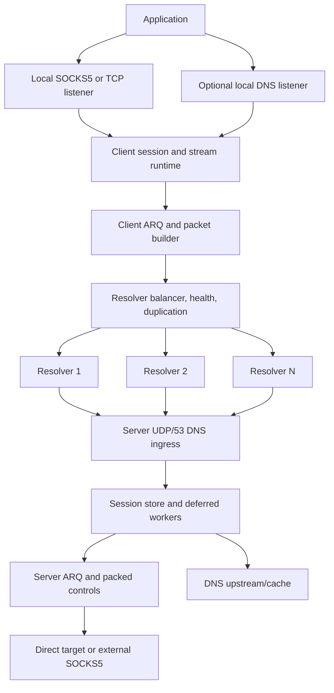
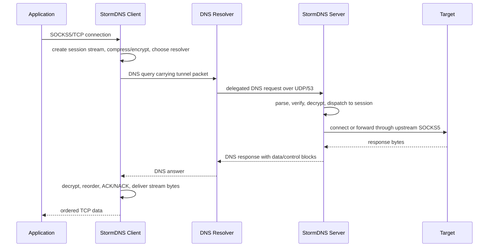

<h1 align="center">⚡ StormDNS</h1>

<p align="center">
  <strong>تونل TCP مبتنی بر DNS برای شبکه‌های فیلترشده، پر packet loss و پر latency.</strong>
</p>

<p align="center">
  <a href="LICENSE"></a>
  
  
  
</p>

<p align="center">
  <a href="README.MD">English</a> ·
  <a href="docs/API.md">HTTP API</a> ·
  <a href="https://github.com/nullroute1970/StormDNS/releases/latest">آخرین Release</a> ·
  <a href="https://t.me/nulllroute1970">کانال تلگرام</a>
</p>

StormDNS یک سیستم تونل client/server است که ترافیک TCP را از طریق پرس‌وجوها و
پاسخ‌های DNS جابه‌جا می‌کند. کلاینت روی دستگاه کاربر اجرا می‌شود و یک پراکسی
محلی SOCKS5/SOCKS4-style در اختیار برنامه‌ها قرار می‌دهد. برنامه‌ها مثل یک
پراکسی معمولی به این listener محلی وصل می‌شوند. سپس StormDNS stream را به
packetهای کوچک و سازگار با DNS تقسیم می‌کند، در صورت نیاز compression و
encryption اعمال می‌کند، packetها را از طریق یک یا چند DNS resolver عمومی
می‌فرستد و در سمت سرور StormDNS دوباره stream را بازسازی می‌کند. سرور در پایان
اتصال واقعی به مقصد را مستقیم یا از طریق SOCKS5 upstream اختیاری برقرار
می‌کند.

این پروژه برای شبکه‌هایی ساخته شده که پروتکل‌های رایج دورزدن محدودیت در آن‌ها
مسدود، کند، active-probe یا ناپایدار می‌شوند، اما مسیر DNS هنوز قابل استفاده
است. چنین شبکه‌هایی معمولاً محدودیت شدید payload در resolverها، latency بالا،
رفتار ناپایدار resolver، upload ضعیف و packet loss زیاد دارند. StormDNS این
شرایط را حالت عادی فرض می‌کند: MTU discovery، health check resolverها،
multi-resolver balancing، packet duplication، ARQ retransmission، ACK/NACK،
packet packing و شروع سریع از logهای sessionهای قبلی برای زنده نگه داشتن تونل
در چنین شبکه‌هایی استفاده می‌شوند.

سناریوی معمول استفاده ساده است: سرور را روی یک VPS با UDP/53 قابل دسترسی اجرا
کنید، یک subdomain کوتاه DNS را به آن سرور delegate کنید، کلید تولیدشده و
domain را داخل config کلاینت بگذارید، resolverهای سالم را اضافه کنید و سپس
مرورگر یا برنامه را به SOCKS5 listener محلی وصل کنید. در راه‌اندازی‌های
پیشرفته‌تر می‌توانید DNS محلی، تنظیمات resolver/MTU، HTTP API محلی برای
monitoring یا عبور خروجی سرور از SOCKS5 خارجی را فعال کنید.

> [!NOTE]
> DNS tunneling با محدودیت اندازه payload، رفتار resolverها، latency، rate
> limit و packet loss روبه‌رو است. هدف StormDNS اتصال قابل استفاده در شرایط
> سخت است، نه ادعای benchmark غیرواقعی یا جایگزینی یک VPN معمولی روی شبکه‌های
> تمیز و پرسرعت.

## 💸 حمایت مالی

حمایت مالی اختیاری است. اگر می‌خواهید از توسعه ادامه‌دار پروژه حمایت کنید، از
یکی از آدرس‌های زیر استفاده کنید:

| 💰 شبکه | 🔐 آدرس |
| --- | --- |
| TON | `UQDfjVk2UdpiMg-bsxqoLa0O_icuaF20D-wWJgIJwK1Ha2Ul` |
| USDT Tron (TRC20) | `TR8ibZGKutPKoDm5nMbHFwGPFBuMKwjG6j` |
| USDT BNB Smart Chain (BEP20) | `0x8c45d6bae8a5a572b2a776779fe0bcae3d3f9107` |

## 🧭 دسترسی سریع

| بخش | لینک |
| --- | --- |
| 🚀 اولین راه‌اندازی | [نصب سریع سرور](#quick-server-setup)، [راه‌اندازی کلاینت](#client-setup) |
| 🌐 نیازمندی دامنه و resolver | [نیازمندی‌های شبکه و دامنه](#network-domain-requirements) |
| ⚙️ تنظیمات | [نمای کلی config](#configuration-overview) |
| 📡 تنظیم resolver و MTU | [تنظیم resolver و MTU](#resolver-mtu-tuning) |
| 🧯 حل مشکل | [عیب‌یابی](#troubleshooting) |
| 🧑‍💻 توسعه | [اجرا از سورس](#running-from-source)، [تست](#testing) |

## 🎯 طراحی‌شده برای شبکه‌های سخت

| واقعیت شبکه | پاسخ StormDNS |
| --- | --- |
| 📏 payload در DNS کوچک است | سربار کم پروتکل، encoding امن برای DNS، کشف فعال MTU |
| 📉 packet loss عادی است | ARQ، ACK/NACK، تایمر retransmission و terminal drain |
| 📡 resolverها کند یا از دسترس خارج می‌شوند | health check، auto-disable، recheck پس‌زمینه و stream failover |
| ⬆️ upload معمولاً گلوگاه است | duplication جداگانه برای upload data، ACK، setup و control |
| 🕒 startup ممکن است زمان‌بر باشد | resolver cache log و شروع سریع از logهای قبلی |

## ✨ قابلیت‌های اصلی

| دسته | قابلیت‌ها |
| --- | --- |
| 🌐 Transport | تونل DNS روی UDP/53، چند domain، مسیریابی روی چند resolver |
| 🧦 دسترسی محلی | SOCKS5 proxy، پردازش SOCKS4-style، حالت raw TCP forwarding |
| 📡 Resolver runtime | random، round-robin، least-loss و lowest-latency |
| 🔁 Reliability | ARQ، ACK/NACK، RTO، retry limit، stream cleanup و packed controls |
| 📦 Efficiency | کشف MTU، packet packing، base encoding اختیاری، ZSTD/LZ4/ZLIB |
| 🔐 Security | None، XOR، ChaCha20، AES-128-GCM، AES-192-GCM، AES-256-GCM |
| 📛 DNS features | DNS listener/cache محلی و DNS upstream/cache سمت سرور |
| 🔎 Operations | HTTP API محلی، installerهای systemd و releaseهای چندسکویی |

## 🗂️ ساختار مخزن

| مسیر | کاربرد |
| --- | --- |
| `cmd/client` | نقطه شروع فایل اجرایی کلاینت |
| `cmd/server` | نقطه شروع فایل اجرایی سرور |
| `internal/client` | runtime کلاینت، SOCKS/TCP listener، balancer، MTU و API |
| `internal/udpserver` | runtime سرور، DNS ingress، sessionها، streamها و workerها |
| `internal/vpnproto` | ساخت، parse و packing packetهای StormDNS |
| `internal/arq` | منطق reliability، retransmission و ACK/NACK |
| `internal/security` | codecهای رمزنگاری و ساخت کلید سرور |
| `internal/compression` | اتصال ZSTD، LZ4 و ZLIB |
| `internal/basecodec` | encoding امن برای DNS |
| `internal/config` | بارگذاری TOML و overrideهای command-line |
| `internal/dnsparser` | parse و ساخت پاسخ DNS |
| `docs/API.md` | مستندات HTTP API کلاینت |
| `scripts/bench` | ابزار benchmark/integration محلی |

<a id="network-domain-requirements"></a>

## 🌐 نیازمندی‌های شبکه و دامنه

برای راه‌اندازی به این موارد نیاز دارید:

- یک سرور با IPv4 عمومی.
- در دسترس بودن UDP port `53` از سمت resolverهای عمومی.
- یک domain یا subdomain که بتوانید آن را به سرور delegate کنید.
- فایل `client_resolvers.txt` در سمت کلاینت.
- کلید رمزنگاری تولیدشده توسط سرور، کپی‌شده داخل `client_config.toml`.

### 🧩 تنظیم DNS و delegation

یک رکورد `A` برای nameserver بسازید و سپس یک رکورد `NS` برای واگذاری subdomain
تونل به آن nameserver اضافه کنید.

مثال:

```text
ns.example.com  A   1.2.3.4
v.example.com   NS  ns.example.com
```

نام delegateشده، مثل `v.example.com`، باید هم در سرور و هم در کلاینت تنظیم شود:

```toml
# server_config.toml
DOMAIN = ["v.example.com"]

# client_config.toml
DOMAINS = ["v.example.com"]
```

اگر دامنه روی Cloudflare است، رکورد `A` مربوط به `ns.example.com` باید روی
**DNS only** باشد و نباید proxied شود.

نام‌های کوتاه بهترند. هر کاراکتر اضافه در query name فضای payload تونل را کم
می‌کند.

<a id="quick-server-setup"></a>

## 🚀 نصب سریع سرور روی Linux

روی سرور لینوکسی اجرا کنید:

```bash
bash <(curl -Ls https://raw.githubusercontent.com/nullroute1970/StormDNS/main/server_linux_install.sh)
```

اسکریپت نصب این کارها را انجام می‌دهد:

- دانلود artifact مناسب، مگر اینکه `--local` استفاده شود؛
- آماده‌سازی `server_config.toml`؛
- پرسیدن domain تونل اگر مقدار نمونه هنوز وجود داشته باشد؛
- آزادسازی port `53` در صورت امکان؛
- باز کردن firewall برای port `53`؛
- اعمال tuning برای UDP و file descriptor؛
- اجرای موقت سرور برای تولید `encrypt_key.txt`؛
- نصب service با نام `stormdns`؛
- نصب egress filter برای reject کردن outbound TCP/53 از سمت سرور.

گزینه‌های installer:

| گزینه | توضیح |
| --- | --- |
| `--version <TAG>` | نصب یک release tag مشخص به جای latest |
| `--local` | استفاده از binary/config محلی از پوشه جاری یا `dist/` |
| `--uninstall` | حذف service، tuningها، binary، config و key از پوشه نصب |
| `--help` | نمایش راهنمای installer |

نصب یک release tag مشخص با `--version`:

```bash
bash <(curl -Ls https://raw.githubusercontent.com/nullroute1970/StormDNS/main/server_linux_install.sh) --version vYYYY.MM.DD.HHMMSS-commithash
```

tag را دقیقاً مطابق مقدار موجود در
[GitHub releases](https://github.com/nullroute1970/StormDNS/releases)
وارد کنید. release tagها معمولاً فرمت `vYYYY.MM.DD.HHMMSS-commithash` دارند؛
قبل از اجرای دستور، placeholder را با یک tag واقعی جایگزین کنید.

حذف service و فایل‌های سرور با `--uninstall`:

```bash
bash <(curl -Ls https://raw.githubusercontent.com/nullroute1970/StormDNS/main/server_linux_install.sh) --uninstall
```

`--version` را نمی‌توان هم‌زمان با `--local` یا `--uninstall` استفاده کرد.

دستورهای مفید service:

```bash
systemctl status stormdns
journalctl -u stormdns -f
systemctl restart stormdns
systemctl stop stormdns
```

سرور هنگام startup کلید فعال را نمایش می‌دهد و آن را در `encrypt_key.txt` ذخیره
می‌کند. این مقدار را داخل config کلاینت قرار دهید.

<a id="client-setup"></a>

## 🧑‍💻 راه‌اندازی کلاینت

release مناسب سیستم خود را از این صفحه دریافت کنید:

```text
https://github.com/nullroute1970/StormDNS/releases/latest
```

archiveهای کلاینت معمولاً شامل این فایل‌ها هستند:

- فایل اجرایی کلاینت؛
- `client_config.toml`؛
- `client_resolvers.txt`؛
- در Linux، فایل `client_linux_install.sh`.

حداقل تغییرات لازم در کلاینت:

```toml
DOMAINS = ["v.example.com"]
DATA_ENCRYPTION_METHOD = 1
ENCRYPTION_KEY = "paste-server-key-here"

PROTOCOL_TYPE = "SOCKS5"
LISTEN_IP = "127.0.0.1"
LISTEN_PORT = 18000
```

resolverها را خط به خط داخل `client_resolvers.txt` قرار دهید:

```text
8.8.8.8
1.1.1.1:53
9.9.9.9
192.0.2.0/30
[2001:4860:4860::8888]:53
```

اجرای دستی در Linux:

```bash
./StormDNS_Client_Linux_AMD64 --config client_config.toml
```

نمونه Windows:

```powershell
.\StormDNS_Client_Windows_AMD64.exe --config client_config.toml
```

سپس در مرورگر یا برنامه خود proxy را روی این مقدار بگذارید:

```text
SOCKS5 127.0.0.1:18000
```

### 🐧 نصب service کلاینت روی Linux

از داخل پوشه extractشده release کلاینت:

```bash
sudo bash client_linux_install.sh
```

نام service برابر `stormdns-client` است:

```bash
systemctl status stormdns-client
journalctl -u stormdns-client -f
systemctl restart stormdns-client
```

<a id="running-from-source"></a>

## 🛠️ اجرا از سورس

نیازمندی‌ها:

- Go `1.25` طبق `go.mod`.
- Git.
- Python فقط برای زمانی که می‌خواهید از `build.py` استفاده کنید.

ساخت برای سیستم فعلی:

```bash
go build ./cmd/client
go build ./cmd/server
```

اجرای binaryهای ساخته‌شده:

```bash
./client --config client_config.toml
./server --config server_config.toml
```

ساخت یک مجموعه محلی در `dist/`:

```bash
python build.py
```

اسکریپت local build چند target محدود را می‌سازد و configهای نمونه را داخل
`dist/` می‌گذارد. release workflow گیت‌هاب matrix بزرگ‌تری برای Windows،
Linux، Linux-Legacy، macOS و Termux/Android می‌سازد.

<a id="configuration-overview"></a>

## ⚙️ نمای کلی config

StormDNS فقط از فایل‌های TOML استفاده می‌کند. مسیر config به‌صورت پیش‌فرض نسبت
به فایل اجرایی resolve می‌شود.

### 🔐 identity و security مشترک

این مقادیر باید بین کلاینت و سرور هماهنگ باشند:

| تنظیم | کلاینت | سرور | توضیح |
| --- | --- | --- | --- |
| دامنه تونل | `DOMAINS` | `DOMAIN` | همه دامنه‌ها باید به همان سرور delegate شوند |
| روش رمزنگاری | `DATA_ENCRYPTION_METHOD` | `DATA_ENCRYPTION_METHOD` | ID روش باید یکی باشد |
| کلید | `ENCRYPTION_KEY` | `ENCRYPTION_KEY_FILE` | سرور کلید را داخل فایل نگه می‌دارد |

IDهای رمزنگاری:

| ID | روش |
| --- | --- |
| `0` | None |
| `1` | XOR |
| `2` | ChaCha20 |
| `3` | AES-128-GCM |
| `4` | AES-192-GCM |
| `5` | AES-256-GCM |

از `0` فقط برای تست محلی استفاده کنید. `1` سربار کمی دارد، اما امنیت آن ضعیف
است. اگر مسیر تحمل سربار بیشتر را دارد، ChaCha20 یا AES-GCM انتخاب‌های بهتری
هستند.

### 🖥️ تنظیمات مهم کلاینت

| بخش | تنظیمات |
| --- | --- |
| پراکسی محلی | `PROTOCOL_TYPE`, `LISTEN_IP`, `LISTEN_PORT`, `SOCKS5_AUTH` |
| DNS محلی | `LOCAL_DNS_ENABLED`, `LOCAL_DNS_IP`, `LOCAL_DNS_PORT` و cache settings |
| انتخاب resolver | `RESOLVER_BALANCING_STRATEGY` |
| duplication | `UPLOAD_PACKET_DUPLICATION_COUNT`, `DOWNLOAD_PACKET_DUPLICATION_COUNT` و setup duplication |
| health check | `AUTO_DISABLE_TIMEOUT_SERVERS`, `RECHECK_INACTIVE_SERVERS_ENABLED` |
| compression | `UPLOAD_COMPRESSION_TYPE`, `DOWNLOAD_COMPRESSION_TYPE`, `COMPRESSION_MIN_SIZE` |
| MTU | `MIN_UPLOAD_MTU`, `MAX_UPLOAD_MTU`, `MIN_DOWNLOAD_MTU`, `MAX_DOWNLOAD_MTU` |
| startup | `STARTUP_MODE`, `LOG_SCAN_MAX_DAYS`, `LOG_SCAN_MAX_RESOLVERS`, `LOG_BASED_MTU_VERIFY` |
| API | `API_ENABLED`, `API_LISTEN_ADDRESS`, `API_LISTEN_PORT` |

حالت‌های startup:

| مقدار | رفتار |
| --- | --- |
| `ask` | سؤال تعاملی برای اسکن resolverها یا استفاده از log |
| `resolvers` | همیشه اسکن کامل از `client_resolvers.txt` |
| `logs` | شروع از resolver cache log و fallback به اسکن کامل در صورت نیاز |

### 🧠 تنظیمات مهم سرور

| بخش | تنظیمات |
| --- | --- |
| domain policy | `DOMAIN`, `PROTOCOL_TYPE`, supported compression lists |
| UDP listener | `UDP_HOST`, `UDP_PORT`, `UDP_READERS`, `DNS_REQUEST_WORKERS` |
| capacity | `MAX_CONCURRENT_REQUESTS`, `SOCKET_BUFFER_SIZE`, `MAX_PACKET_SIZE` |
| deferred runtime | `DEFERRED_SESSION_WORKERS`, `DEFERRED_SESSION_QUEUE_LIMIT` |
| session lifetime | `SESSION_TIMEOUT_SECONDS` و cleanup/retention settings |
| DNS upstream | `DNS_UPSTREAM_SERVERS` و cache/fragment settings |
| outbound path | `USE_EXTERNAL_SOCKS5`, `FORWARD_IP`, `FORWARD_PORT`, `SOCKS5_AUTH` |
| ARQ | window، RTO، retry، TTL، NACK و terminal drain |
| stream limits | `MAX_STREAMS_PER_SESSION`, `MAX_DNS_RESPONSE_BYTES` |

### 📘 مرجع کامل config کلاینت

فایل نمونه کلاینت `client_config.toml.simple` است. همه keyهای داخل آن در جدول‌های
زیر توضیح داده شده‌اند.

#### identity و security تونل

| تنظیم | توضیح | نکته |
| --- | --- | --- |
| `DOMAINS` | دامنه‌های تونل که برای ساخت query nameهای DNS استفاده می‌شوند. | باید حداقل یک دامنه delegateشده داشته باشد و با `DOMAIN` سرور هماهنگ باشد. دامنه کوتاه فضای بیشتری برای payload باقی می‌گذارد. |
| `DATA_ENCRYPTION_METHOD` | ID روش رمزنگاری payload. | باید با سرور یکی باشد. `0` بدون رمزنگاری، `1` XOR، `2` ChaCha20 و `3`/`4`/`5` AES-128/192/256-GCM هستند. |
| `ENCRYPTION_KEY` | کلید مشترک رمزنگاری سمت کلاینت. | اجباری است. مقدار تولیدشده توسط فایل key سرور را اینجا قرار دهید. فاصله‌های ابتدا و انتها حذف می‌شوند. |

#### listener پراکسی محلی

| تنظیم | توضیح | نکته |
| --- | --- | --- |
| `PROTOCOL_TYPE` | حالت محلی کلاینت. | `SOCKS5` یک proxy محلی معمولی می‌دهد. `TCP` حالت raw TCP tunnel را فعال می‌کند. |
| `LISTEN_IP` | آدرس bind برای listener پراکسی محلی. | برای دسترسی فقط محلی `127.0.0.1`، برای سازگاری hostname از `localhost` و فقط در صورت نیاز LAN از `0.0.0.0` استفاده کنید. |
| `LISTEN_PORT` | port محلی TCP برای listener پراکسی. | باید `0..65535` باشد و با API یا DNS listener محلی conflict نداشته باشد. |
| `SOCKS5_AUTH` | احراز هویت username/password روی SOCKS5 محلی را فعال می‌کند. | فقط پراکسی محلی را محافظت می‌کند، نه تونل remote را. اگر listener از localhost بیرون‌تر bind می‌شود، روشن کردن آن توصیه می‌شود. |
| `SOCKS5_USER` | username برای SOCKS5 محلی. | وقتی `SOCKS5_AUTH = true` باشد لازم است؛ حداکثر 255 byte. |
| `SOCKS5_PASS` | password برای SOCKS5 محلی. | حداکثر 255 byte. اگر listener برای دستگاه‌های دیگر قابل دسترسی است، مقدار واقعی و قوی بگذارید. |

#### سرویس DNS محلی

| تنظیم | توضیح | نکته |
| --- | --- | --- |
| `LOCAL_DNS_ENABLED` | DNS listener محلی اختیاری را روشن می‌کند. | در حالت true، کلاینت می‌تواند DNS requestهای محلی را بگیرد و از تونل به سرور بفرستد. |
| `LOCAL_DNS_IP` | آدرس bind برای DNS listener محلی. | اگر خالی باشد به `127.0.0.1` برمی‌گردد. |
| `LOCAL_DNS_PORT` | port UDP برای DNS listener محلی. | باید `0..65535` باشد؛ port `53` ممکن است privilege بالاتر بخواهد. |
| `LOCAL_DNS_CACHE_MAX_RECORDS` | حداکثر تعداد record در cache محلی DNS. | مقدار کمتر از `1` به default امن برمی‌گردد؛ مقدار بزرگ‌تر memory بیشتری مصرف می‌کند. |
| `LOCAL_DNS_CACHE_TTL_SECONDS` | TTL recordهای cache محلی DNS. | مقدار `<= 0` به default برمی‌گردد. |
| `LOCAL_DNS_PENDING_TIMEOUT_SECONDS` | حداکثر زمانی که یک DNS request محلی می‌تواند pending بماند. | requestهای expireشده به‌جای انتظار بی‌نهایت برای fragmentهای پاسخ، locally fail می‌شوند. |
| `DNS_RESPONSE_FRAGMENT_TIMEOUT_SECONDS` | timeout برای assemble کردن fragmentهای پاسخ DNS که از تونل می‌آیند. | در code به `1..600` ثانیه clamp می‌شود. |
| `LOCAL_DNS_CACHE_PERSIST_TO_FILE` | cache محلی DNS را کنار config روی disk ذخیره می‌کند. | مسیر فایل `local_dns_cache.bin` زیر config directory است. |
| `LOCAL_DNS_CACHE_FLUSH_INTERVAL_SECONDS` | فاصله flush روی disk برای cache persistشده. | مقدار `<= 0` به default برمی‌گردد. |

#### انتخاب resolver، duplication و health

| تنظیم | توضیح | نکته |
| --- | --- | --- |
| `RESOLVER_BALANCING_STRATEGY` | روش انتخاب resolverهای کلاینت را تعیین می‌کند. | `1` random، `2` round-robin، `3` least loss و `4` lowest latency. حالت‌های `3` و `4` از feedback زمان اجرا استفاده می‌کنند. |
| `UPLOAD_PACKET_DUPLICATION_COUNT` | تعداد duplicate برای packetهای data آپلود. | روی ترافیک bulk مثل `STREAM_DATA` و resend اعمال می‌شود. به `1..8` clamp می‌شود؛ مقدار بالاتر upload بیشتری مصرف می‌کند. |
| `DOWNLOAD_PACKET_DUPLICATION_COUNT` | تعداد duplicate برای ACK/NACKهای download. | این packetها کوچک‌اند، پس مقدار بالاتر معمولاً reliability دانلود را با هزینه upload کمتر بهتر می‌کند. به `1..8` clamp می‌شود. |
| `UPLOAD_SETUP_PACKET_DUPLICATION_COUNT` | تعداد duplicate برای setupهای upload. | روی `STREAM_SYN` و `SOCKS5_SYN` اعمال می‌شود. حداقل برابر duplication data آپلود و حداکثر `8` می‌شود. |
| `DOWNLOAD_SETUP_PACKET_DUPLICATION_COUNT` | تعداد duplicate برای setup/controlهای download. | روی packed controlها و stream closeها اعمال می‌شود. حداقل برابر duplication ACK دانلود و حداکثر `8` می‌شود. |
| `STREAM_RESOLVER_FAILOVER_RESEND_THRESHOLD` | آستانه resend قبل از اینکه stream بتواند resolver ترجیحی را عوض کند. | به `1..128` clamp می‌شود. مقدار کمتر به خرابی resolver سریع‌تر واکنش می‌دهد. |
| `STREAM_RESOLVER_FAILOVER_COOLDOWN` | حداقل فاصله زمانی بین تغییر resolver ترجیحی برای یک stream. | به `0.1..120` ثانیه clamp می‌شود. |
| `RECHECK_INACTIVE_SERVERS_ENABLED` | resolverهایی را که در تست MTU اولیه fail شده‌اند دوباره بررسی می‌کند. | در background و با MTUهای syncشده فعلی انجام می‌شود. |
| `RECHECK_INACTIVE_INTERVAL_SECONDS` | فاصله یک چرخه کامل recheck برای resolverهای inactive. | در code به `60..86400` ثانیه clamp می‌شود، پس مقدارهای خیلی کوچک بالا برده می‌شوند. |
| `RECHECK_SERVER_INTERVAL_SECONDS` | فاصله بین recheck هر resolver. | به `1..600` ثانیه clamp می‌شود. |
| `RECHECK_BATCH_SIZE` | تعداد resolver inactive/runtime-disabled که در هر cycle تست می‌شوند. | به `1..1024` clamp می‌شود. |
| `AUTO_DISABLE_TIMEOUT_SERVERS` | resolverهایی را که فقط timeout می‌دهند در runtime غیرفعال می‌کند. | بعد از تعداد observation کافی مانع مصرف شدن ترافیک توسط resolver خراب می‌شود. |
| `AUTO_DISABLE_TIMEOUT_WINDOW_SECONDS` | window مشاهده برای auto-disable timeout-only. | به `1..86400` ثانیه clamp می‌شود. |
| `AUTO_DISABLE_MIN_OBSERVATIONS` | حداقل observation لازم قبل از auto-disable. | به `1..10000` clamp می‌شود. |
| `AUTO_DISABLE_CHECK_INTERVAL_SECONDS` | فاصله ارزیابی auto-disable. | به `0.25..600` ثانیه clamp می‌شود. |
| `BASE_ENCODE_DATA` | labelهای payload را قبل از تونل base-encode می‌کند. | معمولاً `false` نگه دارید؛ فقط وقتی مسیر resolver با کاراکترهای محدودتر بهتر کار می‌کند روشن شود. |

#### compression و MTU discovery

| تنظیم | توضیح | نکته |
| --- | --- | --- |
| `UPLOAD_COMPRESSION_TYPE` | compression درخواستی برای payloadهای کلاینت به سرور. | `0` خاموش، `1` ZSTD، `2` LZ4، `3` ZLIB. سرور باید این نوع را allow کند. |
| `DOWNLOAD_COMPRESSION_TYPE` | compression درخواستی برای payloadهای سرور به کلاینت. | IDها مثل upload compression هستند. |
| `COMPRESSION_MIN_SIZE` | حداقل اندازه payload قبل از تلاش برای compression. | مقدار کمتر از `1` به default پکیج compression برمی‌گردد. |
| `MIN_UPLOAD_MTU` | حداقل MTU قابل قبول برای upload بعد از تست resolver. | وقتی resolverهای زیادی fail می‌شوند پایین‌تر بگذارید؛ `0` عملاً lower bound را حذف می‌کند. |
| `MIN_DOWNLOAD_MTU` | حداقل MTU قابل قبول برای download بعد از تست resolver. | مقدار بالاتر efficiency را بهتر می‌کند ولی مسیرهای resolver بیشتری را reject می‌کند. |
| `MAX_UPLOAD_MTU` | سقف جست‌وجوی MTU برای upload. | وقتی min و max هر دو set هستند باید حداقل برابر min upload باشد. |
| `MAX_DOWNLOAD_MTU` | سقف جست‌وجوی MTU برای download. | وقتی min و max هر دو set هستند باید حداقل برابر min download باشد. |
| `MTU_TEST_RETRIES_RESOLVERS` | تعداد retry برای اسکن کامل فایل resolverها. | باید حداقل `1` باشد؛ برای discovery سریع کمتر و برای لینک noisy بیشتر بگذارید. |
| `MTU_TEST_TIMEOUT_RESOLVERS` | timeout هر probe در اسکن کامل resolverها. | بر حسب ثانیه. مقدار بالاتر به resolverهای پر latency کمک می‌کند ولی startup را کند می‌کند. |
| `MTU_TEST_PARALLELISM_RESOLVERS` | تعداد probe موازی در اسکن کامل resolverها. | باید حداقل `1` باشد؛ مقدار بالا scan را سریع‌تر می‌کند اما burst traffic را زیاد می‌کند. |
| `MTU_TEST_RETRIES_LOGS` | تعداد retry هنگام startup از resolver cache log. | فقط وقتی startup mode فعال `logs` باشد استفاده می‌شود. |
| `MTU_TEST_TIMEOUT_LOGS` | timeout هر probe برای MTU verification مبتنی بر log. | وقتی `LOG_BASED_MTU_VERIFY = true` باشد استفاده می‌شود. |
| `MTU_TEST_PARALLELISM_LOGS` | parallelism برای MTU verification مبتنی بر log. | معمولاً از scan کامل کمتر است چون resolverها قبلاً filter شده‌اند. |

#### workerها، queueها و timerهای runtime

| تنظیم | توضیح | نکته |
| --- | --- | --- |
| `RX_TX_WORKERS` | تعداد workerهای async دریافت/ارسال تونل. | باید حداقل `1` باشد؛ keyهای legacy reader/writer فقط وقتی این key حذف شود اثر دارند. |
| `TUNNEL_PROCESS_WORKERS` | تعداد workerهای پردازش packet. | باید حداقل `1` باشد؛ افزایش آن برای client شلوغ مفید است ولی CPU بیشتری مصرف می‌کند. |
| `TUNNEL_PACKET_TIMEOUT_SECONDS` | timeout هر packet در مسیرهای async runtime. | به `0.5..120` ثانیه clamp می‌شود. |
| `DISPATCHER_IDLE_POLL_INTERVAL_SECONDS` | فاصله polling وقتی dispatcher idle است. | به `0.001..1` clamp می‌شود؛ مقدار کمتر wake latency را کم و CPU را زیاد می‌کند. |
| `TX_CHANNEL_SIZE` | ظرفیت channel مسیر transmit. | به `64..65536` clamp می‌شود. |
| `RX_CHANNEL_SIZE` | ظرفیت channel مسیر receive. | به `64..65536` clamp می‌شود. |
| `RESOLVER_UDP_CONNECTION_POOL_SIZE` | اندازه pool اتصال UDP برای هر resolver key. | به `1..1024` clamp می‌شود. |
| `STREAM_QUEUE_INITIAL_CAPACITY` | ظرفیت اولیه queueهای stream. | در تعداد stream بالا realloc کمتر می‌شود. |
| `ORPHAN_QUEUE_INITIAL_CAPACITY` | ظرفیت اولیه queue packetهای orphan. | packetهایی را نگه می‌دارد که قبل از آماده بودن stream/session صاحبشان رسیده‌اند. |
| `DNS_RESPONSE_FRAGMENT_STORE_CAPACITY` | ظرفیت اولیه store برای fragmentهای پاسخ DNS محلی. | در code clamp می‌شود و روی پاسخ‌های DNS-over-tunnel چندfragmentی اثر دارد. |
| `SOCKS_UDP_ASSOCIATE_READ_TIMEOUT_SECONDS` | read timeout برای SOCKS UDP ASSOCIATE محلی. | به `1..3600` ثانیه clamp می‌شود. |
| `CLIENT_TERMINAL_STREAM_RETENTION_SECONDS` | زمان نگهداری streamهای terminal قبل از cleanup. | به `1..3600` ثانیه clamp می‌شود. |
| `CLIENT_CANCELLED_SETUP_RETENTION_SECONDS` | زمان نگهداری setup streamهای cancelشده. | به `1..3600` ثانیه clamp می‌شود. |
| `SESSION_INIT_RETRY_BASE_SECONDS` | delay اولیه بعد از init/reset ناموفق session. | به `0.1..60` ثانیه clamp می‌شود. |
| `SESSION_INIT_RETRY_STEP_SECONDS` | مقدار افزایشی delay retry session-init. | به `0..60` ثانیه clamp می‌شود. |
| `SESSION_INIT_RETRY_LINEAR_AFTER` | تعداد retry که بعد از آن رشد delay حالت linear می‌گیرد. | به `0..1000` clamp می‌شود. |
| `SESSION_INIT_RETRY_MAX_SECONDS` | حداکثر delay retry session-init. | حداقل برابر base delay و حداکثر `3600` ثانیه می‌شود. |
| `SESSION_INIT_BUSY_RETRY_INTERVAL_SECONDS` | delay بعد از دریافت `SESSION_BUSY` از سرور. | به `1..3600` ثانیه clamp می‌شود. |
| `PING_AGGRESSIVE_INTERVAL_SECONDS` | فاصله keepalive در فعال‌ترین حالت. | بلافاصله بعد از ترافیک non-ping اخیر استفاده می‌شود. |
| `PING_LAZY_INTERVAL_SECONDS` | فاصله keepalive برای session گرم ولی کم‌فعالیت‌تر. | بین responsiveness و query volume تعادل می‌دهد. |
| `PING_COOLDOWN_INTERVAL_SECONDS` | فاصله keepalive هنگام سرد شدن activity. | قبل از حالت کاملاً cold استفاده می‌شود. |
| `PING_COLD_INTERVAL_SECONDS` | فاصله keepalive برای session سرد. | session idle را با query volume کمتر زنده نگه می‌دارد. |
| `PING_WARM_THRESHOLD_SECONDS` | threshold activity اخیر برای رفتار ping گرم. | با timestamp ترافیک اخیر مقایسه می‌شود. |
| `PING_COOL_THRESHOLD_SECONDS` | threshold برای رفتار cooldown ping. | در config معمولی از warm threshold بزرگ‌تر است. |
| `PING_COLD_THRESHOLD_SECONDS` | threshold برای رفتار cold ping. | در config معمولی از cool threshold بزرگ‌تر است. |
| `PING_WATCHDOG_TIMEOUT_SECONDS` | اگر ارسال فعال انجام شود اما هیچ پاسخ سروری نرسد، session را restart می‌کند. | به `10..3600` clamp می‌شود؛ `0` watchdog را خاموش می‌کند. |

#### ARQ reliability و packing

| تنظیم | توضیح | نکته |
| --- | --- | --- |
| `MAX_PACKETS_PER_BATCH` | حداکثر control block که در یک batch خروجی pack می‌شود. | به `1..64` clamp می‌شود. |
| `ARQ_WINDOW_SIZE` | اندازه send window برای ARQ هر stream. | window بزرگ‌تر روی مسیرهای latency بالا throughput بهتری می‌دهد ولی memory بیشتری مصرف می‌کند. |
| `ARQ_INITIAL_RTO_SECONDS` | timeout اولیه retransmission برای data. | در code clamp می‌شود و بهتر است از `ARQ_MAX_RTO_SECONDS` کمتر باشد. |
| `ARQ_MAX_RTO_SECONDS` | حداکثر timeout retransmission برای data. | بعد از normalization حداقل برابر initial data RTO است. |
| `ARQ_CONTROL_INITIAL_RTO_SECONDS` | timeout اولیه retransmission برای control packet. | control شامل setup، ACK/NACK، close و packetهای reliability مشابه است. |
| `ARQ_CONTROL_MAX_RTO_SECONDS` | حداکثر timeout retransmission برای control packet. | بعد از normalization حداقل برابر initial control RTO است. |
| `ARQ_MAX_CONTROL_RETRIES` | حداکثر تلاش retransmission برای control packet. | مقدار بالاتر setup/close را روی لینک lossy بیشتر زنده نگه می‌دارد. |
| `ARQ_INACTIVITY_TIMEOUT_SECONDS` | timeout عدم فعالیت برای stateهای ARQ stream. | جلوی ماندن همیشگی streamهای مرده را می‌گیرد. |
| `ARQ_DATA_PACKET_TTL_SECONDS` | عمر نگهداری data packet برای resend احتمالی. | روی مسیرهای پر latency باید از دوره‌های عادی retransmission بیشتر باشد. |
| `ARQ_CONTROL_PACKET_TTL_SECONDS` | عمر نگهداری control packet برای resend احتمالی. | معمولاً از data TTL کوتاه‌تر است. |
| `ARQ_MAX_DATA_RETRIES` | حداکثر تلاش retransmission برای data packet. | مقدار بالاتر outage طولانی‌تر را تحمل می‌کند ولی state را بیشتر نگه می‌دارد. |
| `ARQ_DATA_NACK_MAX_GAP` | حداکثر gap جلوتر از receive sequence که می‌تواند NACK data بسازد. | `0` تولید NACK را خاموش می‌کند؛ مقدار کوچک فقط near-miss resendها را درخواست می‌کند. |
| `ARQ_DATA_NACK_INITIAL_DELAY_SECONDS` | delay قبل از اولین NACK برای sequence missing. | به `0.1..30` ثانیه clamp می‌شود. |
| `ARQ_DATA_NACK_REPEAT_SECONDS` | حداقل فاصله بین NACKهای تکراری برای همان sequence. | به `0.1..30` ثانیه clamp می‌شود. |
| `ARQ_TERMINAL_DRAIN_TIMEOUT_SECONDS` | زمان مجاز برای drain شدن stream terminal. | اجازه می‌دهد data نهایی و close/ACK state قبل از cleanup settle شوند. |
| `ARQ_TERMINAL_ACK_WAIT_TIMEOUT_SECONDS` | مدت انتظار streamهای terminal برای acknowledgement نهایی. | جلوی انتظار بی‌نهایت در مسیر close را می‌گیرد. |

#### logging، startup، API و metadata

| تنظیم | توضیح | نکته |
| --- | --- | --- |
| `LOG_LEVEL` | verbosity لاگ console/file. | مقدارهای رایج `DEBUG`، `INFO`، `WARN` و `ERROR` هستند. |
| `LOG_TO_FILE` | session log و resolver-cache log را فعال می‌کند. | resolver-cache log برای startup مبتنی بر log استفاده می‌شود. |
| `LOG_DIR` | پوشه فایل‌های log. | مسیر relative نسبت به config directory resolve می‌شود. |
| `LOG_FILE_NAME` | template نام فایل session log. | `{time}` به timestamp زمان startup تبدیل می‌شود. |
| `STATS_REPORT_INTERVAL_SECONDS` | فاصله گزارش سرعت و مجموع traffic. | `0` reporter آمار را خاموش می‌کند؛ مقدار مثبت به `1..3600` clamp می‌شود. |
| `STARTUP_MODE` | مسیر startup resolver را انتخاب می‌کند. | `ask`، `resolvers` یا `logs`؛ مقدار invalid به `ask` برمی‌گردد. |
| `LOG_SCAN_MAX_DAYS` | حداکثر سن resolver-cache logها برای startup از log. | `0` یعنی بدون محدودیت سنی؛ مقدار منفی `0` می‌شود. |
| `LOG_SCAN_MAX_RESOLVERS` | حداکثر resolver قابل load از cache log. | `0` یعنی همه resolverهای پیدا شده؛ مقدار منفی `0` می‌شود. |
| `LOG_BASED_MTU_VERIFY` | حتی در startup از log هم MTU verification اجرا می‌کند. | `false` سریع‌تر است؛ `true` بررسی می‌کند resolverهای cacheشده هنوز کار می‌کنند. |
| `API_ENABLED` | HTTP API محلی را فعال می‌کند. | توضیح endpointها در [HTTP API](docs/API.md) آمده است. |
| `API_LISTEN_ADDRESS` | آدرس bind برای HTTP API محلی. | مگر اینکه واقعاً LAN access لازم باشد، `127.0.0.1` نگه دارید. |
| `API_LISTEN_PORT` | port TCP برای HTTP API محلی. | باید `0..65535` باشد و با `LISTEN_PORT` یا `LOCAL_DNS_PORT` فعال conflict نداشته باشد. |
| `CONFIG_VERSION` | marker نسخه sample config. | برای انسان/installer نگه داشته شده؛ config loader فعلی Go فیلدهای ناشناخته TOML را ignore می‌کند. |

### 📗 مرجع کامل config سرور

فایل نمونه سرور `server_config.toml.simple` است. همه keyهای داخل آن در جدول‌های
زیر توضیح داده شده‌اند.

#### tunnel policy

| تنظیم | توضیح | نکته |
| --- | --- | --- |
| `DOMAIN` | دامنه‌هایی که سرور برای تونل می‌پذیرد. | باید با `DOMAINS` کلاینت هماهنگ باشد و از طریق DNS delegation به همین سرور برسد. |
| `PROTOCOL_TYPE` | حالت outbound سرور. | `SOCKS5` مقصد درخواست‌شده توسط کلاینت را استفاده می‌کند؛ `TCP` همه streamها را به `FORWARD_IP:FORWARD_PORT` می‌فرستد. |
| `SUPPORTED_UPLOAD_COMPRESSION_TYPES` | روش‌های compression آپلود که سرور از کلاینت می‌پذیرد. | IDهای compression از `0..3` هستند؛ مقدارهای duplicate، unavailable یا invalid حذف می‌شوند. |
| `SUPPORTED_DOWNLOAD_COMPRESSION_TYPES` | روش‌های compression دانلود که سرور از کلاینت می‌پذیرد. | برای اجازه ترافیک بدون compression مقدار `0` را نگه دارید. لیست خالی/invalid به `[0]` normalize می‌شود. |

#### UDP listener و ظرفیت ورودی

| تنظیم | توضیح | نکته |
| --- | --- | --- |
| `UDP_HOST` | آدرس bind برای ورودی DNS tunnel. | اگر خالی باشد `0.0.0.0` می‌شود. |
| `UDP_PORT` | port UDP برای ورودی DNS tunnel. | باید `1..65535` باشد؛ deployment عمومی معمولاً `53` است. |
| `UDP_READERS` | تعداد goroutineهای خواندن UDP. | مقدار `<= 0` از default خودکار با حداقل `4` و سقف `8` استفاده می‌کند. |
| `DNS_REQUEST_WORKERS` | تعداد workerهای پردازش DNS request parseشده. | مقدار `<= 0` از default خودکار با حداقل `8` و سقف `32` استفاده می‌کند. |
| `MAX_CONCURRENT_REQUESTS` | اندازه queue جلوی workerهای DNS request. | وقتی queue پر شود packetها drop می‌شوند و overload log با rate limit ثبت می‌شود. |
| `SOCKET_BUFFER_SIZE` | اندازه buffer خواندن/نوشتن socket UDP بر حسب byte. | buffer بزرگ‌تر burstها را بهتر جذب می‌کند، البته محدود به تنظیمات OS است. |
| `MAX_PACKET_SIZE` | حداکثر اندازه packet buffer در pool سرور. | مقدار `<= 0` به `65535` برمی‌گردد. |
| `DROP_LOG_INTERVAL_SECONDS` | حداقل فاصله بین logهای overload/drop. | مقدار `<= 0` به `2` ثانیه برمی‌گردد. |

#### runtime deferred و ظرفیت stream

| تنظیم | توضیح | نکته |
| --- | --- | --- |
| `DEFERRED_SESSION_WORKERS` | تعداد worker برای پردازش deferred هر session. | به `0..128` clamp می‌شود؛ `0` pool را غیرفعال می‌کند. |
| `DEFERRED_SESSION_QUEUE_LIMIT` | محدودیت queue برای کارهای deferred هر session. | به `256..14336` clamp می‌شود. |
| `SESSION_ORPHAN_QUEUE_INITIAL_CAPACITY` | ظرفیت اولیه orphan queueهای session. | به `4..4096` clamp می‌شود. |
| `STREAM_QUEUE_INITIAL_CAPACITY` | ظرفیت اولیه queueهای هر stream. | به `8..65536` clamp می‌شود. |
| `DNS_FRAGMENT_STORE_CAPACITY` | ظرفیت اولیه assemble fragmentهای DNS query ورودی. | به `16..16384` clamp می‌شود. |
| `SOCKS5_FRAGMENT_STORE_CAPACITY` | ظرفیت اولیه assemble fragmentهای setup SOCKS5. | به `16..16384` clamp می‌شود. |
| `MAX_STREAMS_PER_SESSION` | حداکثر stream data همزمان برای هر session. | به `16..65535` clamp می‌شود؛ control stream `0` حساب نمی‌شود. |
| `MAX_DNS_RESPONSE_BYTES` | حداکثر اندازه upstream DNS response که می‌تواند fragment و به کلاینت برگردانده شود. | به `512..65535` clamp می‌شود؛ پاسخ بزرگ‌تر قبل از fragmentation drop می‌شود. |

#### lifecycle session و invalid cookie

| تنظیم | توضیح | نکته |
| --- | --- | --- |
| `INVALID_COOKIE_WINDOW_SECONDS` | sliding window برای tracking invalid cookie. | مقدار `<= 0` به `2` ثانیه برمی‌گردد. |
| `INVALID_COOKIE_ERROR_THRESHOLD` | تعداد hit invalid cookie قابل تحمل داخل window. | مقدار `<= 0` به `10` برمی‌گردد؛ عبور از threshold رفتار error را شدیدتر می‌کند. |
| `SESSION_TIMEOUT_SECONDS` | timeout عدم فعالیت session. | مقدار `<= 0` به `300` ثانیه برمی‌گردد. |
| `SESSION_CLEANUP_INTERVAL_SECONDS` | فاصله cleanup پس‌زمینه sessionها. | مقدار `<= 0` به `10` ثانیه برمی‌گردد. |
| `CLOSED_SESSION_RETENTION_SECONDS` | مدت نگهداری metadata session بسته‌شده. | مقدار `<= 0` به `600` ثانیه برمی‌گردد. |
| `SESSION_INIT_REUSE_TTL_SECONDS` | مدت قابل reuse بودن signature پذیرفته‌شده session-init. | به `1..86400` ثانیه clamp می‌شود. |
| `RECENTLY_CLOSED_STREAM_TTL_SECONDS` | مدت باقی ماندن stream ID بسته‌شده در جدول recently-closed. | به `1..86400` ثانیه clamp می‌شود. |
| `RECENTLY_CLOSED_STREAM_CAP` | حداکثر recordهای recently-closed stream برای هر session. | به `1..1000000` clamp می‌شود. |
| `TERMINAL_STREAM_RETENTION_SECONDS` | مدت نگهداری stream terminal قبل از sweep cleanup. | به `1..86400` ثانیه clamp می‌شود. |

#### DNS upstream تونل

| تنظیم | توضیح | نکته |
| --- | --- | --- |
| `DNS_UPSTREAM_SERVERS` | resolverهای upstream برای DNS requestهای تونل‌شده. | بهتر است host و port داشته باشند، مثل `1.1.1.1:53`. لیست خالی به `1.1.1.1:53` برمی‌گردد. |
| `DNS_UPSTREAM_TIMEOUT` | timeout هر تلاش exchange با upstream DNS. | مقدار `<= 0` به `4` ثانیه برمی‌گردد. |
| `DNS_INFLIGHT_WAIT_TIMEOUT_SECONDS` | timeout انتظار برای requestهای DNS duplicate که lookup inflight مشترک دارند. | به `0.1..120` ثانیه clamp می‌شود. |
| `DNS_FRAGMENT_ASSEMBLY_TIMEOUT` | timeout assemble کردن fragmentهای DNS query تونل‌شده ورودی. | مقدار `<= 0` به `300` ثانیه برمی‌گردد. |
| `DNS_CACHE_MAX_RECORDS` | حداکثر record در cache DNS تونل سمت سرور. | مقدار کمتر از `1` به default امن برمی‌گردد. |
| `DNS_CACHE_TTL_SECONDS` | TTL entryهای cache DNS تونل سمت سرور. | مقدار `<= 0` به `3600` ثانیه برمی‌گردد. |

#### مسیر outbound و security

| تنظیم | توضیح | نکته |
| --- | --- | --- |
| `SOCKS_CONNECT_TIMEOUT` | timeout اتصال TCP outbound. | روی اتصال مستقیم و setup اتصال SOCKS upstream اثر دارد؛ مقدار `<= 0` به `8` ثانیه برمی‌گردد و تلاش‌های deferred connect سقف `15` ثانیه دارند. |
| `USE_EXTERNAL_SOCKS5` | در حالت SOCKS5 خروجی سرور را از یک SOCKS5 proxy دیگر عبور می‌دهد. | به `FORWARD_IP` و `FORWARD_PORT` مثبت نیاز دارد؛ رفتار forwarding در حالت `TCP` را عوض نمی‌کند. |
| `SOCKS5_AUTH` | auth username/password برای SOCKS5 upstream را فعال می‌کند. | فقط با `PROTOCOL_TYPE = "SOCKS5"` و `USE_EXTERNAL_SOCKS5 = true` استفاده می‌شود. |
| `SOCKS5_USER` | username برای SOCKS5 upstream. | با `SOCKS5_AUTH = true` لازم است؛ حداکثر 255 byte. |
| `SOCKS5_PASS` | password برای SOCKS5 upstream. | با `SOCKS5_AUTH = true` لازم است؛ حداکثر 255 byte. |
| `FORWARD_IP` | در حالت `TCP` مقصد ثابت، و در external SOCKS آدرس proxy upstream است. | در حالت مستقیم و معمولی `SOCKS5` استفاده نمی‌شود. |
| `FORWARD_PORT` | در حالت `TCP` port مقصد ثابت، و در external SOCKS port proxy upstream است. | باید `0..65535` باشد؛ وقتی external SOCKS5 روشن است باید مثبت باشد. |
| `DATA_ENCRYPTION_METHOD` | ID روش رمزنگاری payload. | باید با کلاینت یکی باشد؛ مقدار invalid سمت سرور به `1` normalize می‌شود. |
| `ENCRYPTION_KEY_FILE` | مسیر فایل encryption key سرور. | مسیر relative نسبت به config directory resolve می‌شود. سرور هنگام startup این key را load/create می‌کند. |

#### ARQ، packing، logging و metadata

| تنظیم | توضیح | نکته |
| --- | --- | --- |
| `MAX_PACKETS_PER_BATCH` | حداکثر control block که در یک response pack می‌شود. | مقدار کمتر از `1` در code به `20` برمی‌گردد؛ sample نزدیک مقدار کلاینت نگه داشته شده است. |
| `PACKET_BLOCK_CONTROL_DUPLICATION` | آخرین packed control-block response را برای چند turn dispatcher تکرار می‌کند. | به `1..4` clamp می‌شود؛ `1` یعنی غیرفعال. |
| `STREAM_SETUP_ACK_TTL_SECONDS` | TTL برای control packetهای setup ACK. | به `1..86400` ثانیه clamp می‌شود. |
| `STREAM_RESULT_PACKET_TTL_SECONDS` | TTL برای control packetهای setup/result موفق. | به `1..86400` ثانیه clamp می‌شود. |
| `STREAM_FAILURE_PACKET_TTL_SECONDS` | TTL برای control packetهای setup/result ناموفق. | به `1..86400` ثانیه clamp می‌شود. |
| `ARQ_WINDOW_SIZE` | send window برای ARQ هر stream. | به `1..6000` clamp می‌شود. |
| `ARQ_INITIAL_RTO_SECONDS` | timeout اولیه retransmission برای data. | به `0.05..60` ثانیه clamp می‌شود. |
| `ARQ_MAX_RTO_SECONDS` | حداکثر timeout retransmission برای data. | حداقل برابر initial data RTO و حداکثر `120` ثانیه می‌شود. |
| `ARQ_CONTROL_INITIAL_RTO_SECONDS` | timeout اولیه retransmission برای control. | به `0.05..60` ثانیه clamp می‌شود. |
| `ARQ_CONTROL_MAX_RTO_SECONDS` | حداکثر timeout retransmission برای control. | حداقل برابر initial control RTO و حداکثر `120` ثانیه می‌شود. |
| `ARQ_MAX_CONTROL_RETRIES` | حداکثر retry برای control packet. | به `5..5000` clamp می‌شود. |
| `ARQ_INACTIVITY_TIMEOUT_SECONDS` | timeout عدم فعالیت stateهای ARQ. | به `30..86400` ثانیه clamp می‌شود. |
| `ARQ_DATA_PACKET_TTL_SECONDS` | عمر نگهداری data packet. | به `30..86400` ثانیه clamp می‌شود. |
| `ARQ_CONTROL_PACKET_TTL_SECONDS` | عمر نگهداری control packet. | به `30..86400` ثانیه clamp می‌شود. |
| `ARQ_MAX_DATA_RETRIES` | حداکثر retry برای data packet. | به `60..100000` clamp می‌شود. |
| `ARQ_DATA_NACK_MAX_GAP` | حداکثر gap out-of-order دریافت که می‌تواند NACK بسازد. | به `0..ARQ_WINDOW_SIZE/4` clamp می‌شود؛ `0` تولید NACK را خاموش می‌کند. |
| `ARQ_DATA_NACK_INITIAL_DELAY_SECONDS` | delay قبل از اولین NACK برای sequence missing. | به `0.2..30` ثانیه clamp می‌شود. |
| `ARQ_DATA_NACK_REPEAT_SECONDS` | حداقل فاصله بین NACKهای تکراری برای همان sequence. | به `0.3..30` ثانیه clamp می‌شود. |
| `ARQ_TERMINAL_DRAIN_TIMEOUT_SECONDS` | زمان مجاز برای drain شدن stream terminal. | به `10..3600` ثانیه clamp می‌شود. |
| `ARQ_TERMINAL_ACK_WAIT_TIMEOUT_SECONDS` | مدت انتظار streamهای terminal برای acknowledgement نهایی. | به `5..3600` ثانیه clamp می‌شود. |
| `LOG_LEVEL` | verbosity لاگ سرور. | مقدارهای رایج `DEBUG`، `INFO`، `WARN` و `ERROR` هستند. |
| `CONFIG_VERSION` | marker نسخه sample config. | برای انسان/installer نگه داشته شده؛ config loader فعلی Go فیلدهای ناشناخته TOML را ignore می‌کند. |

<a id="resolver-mtu-tuning"></a>

## 📡 تنظیم resolver و MTU

کیفیت resolver تعیین می‌کند تونل واقعاً قابل استفاده هست یا نه. ممکن است یک
resolver برای DNS معمولی خوب باشد، اما برای payload بزرگ، label طولانی یا
درخواست‌های تکراری تونل مناسب نباشد. اجازه دهید کلاینت resolverها را تست کند.

مسیر عملی:

1. با sample config شروع کنید.
2. تعداد زیادی resolver candidate داخل `client_resolvers.txt` بگذارید.
3. با `STARTUP_MODE = "resolvers"` اجرا کنید.
4. `LOG_TO_FILE = true` را روشن نگه دارید تا نتیجه resolver/MTU ذخیره شود.
5. بعد از یک session موفق، برای startup سریع‌تر از `STARTUP_MODE = "logs"`
   استفاده کنید.

اگر startup طولانی است، بازه MTU را کوچک‌تر کنید:

```toml
MIN_UPLOAD_MTU = 80
MAX_UPLOAD_MTU = 180
MIN_DOWNLOAD_MTU = 700
MAX_DOWNLOAD_MTU = 2500
```

اگر resolverهای زیادی fail می‌شوند، حداقل MTU را پایین بیاورید. اگر تونل
پایدار ولی کند است، maximumها را کم‌کم بالا ببرید و دوباره تست کنید.

برای اسکن resolverها می‌توانید از probe کوچک و parallelism بالا استفاده کنید:

```toml
STARTUP_MODE = "resolvers"
MIN_UPLOAD_MTU = 30
MAX_UPLOAD_MTU = 30
MIN_DOWNLOAD_MTU = 40
MAX_DOWNLOAD_MTU = 40
MTU_TEST_RETRIES_RESOLVERS = 1
MTU_TEST_TIMEOUT_RESOLVERS = 1.0
MTU_TEST_PARALLELISM_RESOLVERS = 200
```

قبل از اسکن باید domain و key سرور درست تنظیم شده باشند، چون تست MTU مسیر
واقعی تونل را امتحان می‌کند.

## 📦 راهنمای duplication و compression

duplication احتمال رسیدن packet را بالا می‌برد، اما تعداد DNS queryها را هم
زیاد می‌کند.

پروفایل معمول برای شبکه lossy:

```toml
UPLOAD_PACKET_DUPLICATION_COUNT = 1
DOWNLOAD_PACKET_DUPLICATION_COUNT = 4
UPLOAD_SETUP_PACKET_DUPLICATION_COUNT = 2
DOWNLOAD_SETUP_PACKET_DUPLICATION_COUNT = 4
```

اگر upload بسیار ضعیف است، duplication داده upload را پایین نگه دارید.
duplication مربوط به ACKهای download و control معمولاً هزینه کمتری دارد چون
packetهای کوچکی هستند.

IDهای compression:

| ID | روش |
| --- | --- |
| `0` | OFF |
| `1` | ZSTD |
| `2` | LZ4 |
| `3` | ZLIB |

LZ4 معمولاً انتخاب عملی خوبی برای دستگاه‌های ضعیف و شبکه ناپایدار است. ZSTD
در داده‌های قابل فشرده‌سازی کاهش بیشتری می‌دهد، اما CPU بیشتری مصرف می‌کند.
compression برای ترافیک‌هایی که از قبل فشرده‌اند، مثل بیشتر ویدئوها، archiveها
و payloadهای HTTPS مدرن، کمک زیادی نمی‌کند.

## 🔎 HTTP API محلی

کلاینت می‌تواند API محلی ارائه کند:

```toml
API_ENABLED = true
API_LISTEN_ADDRESS = "127.0.0.1"
API_LISTEN_PORT = 9157
```

نمونه‌ها:

```bash
curl http://127.0.0.1:9157/api/v1/status
curl http://127.0.0.1:9157/api/v1/resolvers
curl -X POST http://127.0.0.1:9157/api/v1/restart-session
```

مستندات کامل در [docs/API.md](docs/API.md) قرار دارد.

API را روی `127.0.0.1` نگه دارید مگر اینکه عمداً بخواهید آن را روی LAN قابل
دسترسی کنید. این API endpointهای کنترلی دارد و authentication داخلی ندارد.

## 📱 استفاده روی موبایل

در این مخزن اپلیکیشن رسمی موبایل وجود ندارد.

روش‌های قابل استفاده:

- کلاینت را روی کامپیوتر اجرا کنید و `LISTEN_IP = "0.0.0.0"` بگذارید تا گوشی
  روی همان LAN از SOCKS5 آن استفاده کند.
- کلاینت را روی یک VPS کوچک یا router اجرا کنید و موبایل‌ها را به SOCKS5 آن
  وصل کنید.
- خروجی یک proxy/panel دیگر را به SOCKS5 محلی StormDNS بدهید.

اگر کلاینت را روی `0.0.0.0` bind می‌کنید، احراز هویت SOCKS5 را فعال کنید:

```toml
SOCKS5_AUTH = true
SOCKS5_USER = "choose-a-user"
SOCKS5_PASS = "choose-a-strong-password"
```

SOCKS5 بدون رمز را روی اینترنت باز نگذارید.

## 🏗️ معماری



جریان کلی packet:



<a id="troubleshooting"></a>

## 🧯 عیب‌یابی

### 🌐 سرور ترافیک دریافت نمی‌کند

- مطمئن شوید رکورد `NS` زیر دامنه را به nameserver شما delegate کرده است.
- مطمئن شوید host مربوط به nameserver رکورد `A` درست به IP سرور دارد.
- مطمئن شوید DNS provider رکورد `A` nameserver را proxy نکرده است.
- مطمئن شوید UDP port `53` در firewall سرور و پنل provider باز است.
- تست مستقیم:

```bash
dig v.example.com NS
dig @ns.example.com v.example.com A
```

### 🚧 port 53 اشغال است

در بسیاری از سیستم‌های Linux، سرویس `systemd-resolved` روی port `53` گوش
می‌دهد. installer تلاش می‌کند این وضعیت را مدیریت کند. رفع دستی:

```bash
sudo nano /etc/systemd/resolved.conf
```

این مقدار را تنظیم کنید:

```text
DNSStubListener=no
```

سپس:

```bash
sudo systemctl restart systemd-resolved
```

روی یک IP/port فقط یک DNS server می‌تواند همزمان listen کند.

### 🕒 startup کلاینت کند است

- بعد از یک اسکن موفق از `STARTUP_MODE = "logs"` استفاده کنید.
- بازه‌های MTU را کوچک‌تر کنید.
- مقدار `MTU_TEST_RETRIES_RESOLVERS` را کاهش دهید.
- resolverهایی را که همیشه fail می‌شوند از `client_resolvers.txt` حذف کنید.

### 🧊 تونل وصل می‌شود اما سایت‌ها گیر می‌کنند

- upload MTU و download MTU را پایین بیاورید.
- duplication مربوط به download ACK/control را بیشتر کنید.
- برای loss کمتر از `RESOLVER_BALANCING_STRATEGY = 3` استفاده کنید.
- resolverهای بیشتری از شبکه‌های مختلف تست کنید.
- endpoint `/api/v1/resolvers` را بررسی کنید تا مسیرهای timeout-only مشخص شود.

### 🧦 SOCKS روی همان سیستم کار می‌کند اما از دستگاه دیگر نه

- `LISTEN_IP = "0.0.0.0"` بگذارید.
- firewall سیستم کلاینت را برای `LISTEN_PORT` باز کنید.
- SOCKS5 authentication را فعال کنید.
- از روی گوشی یا دستگاه دیگر، IP داخل LAN را بزنید؛ `127.0.0.1` فقط همان
  دستگاه محلی است.

## 🏷️ release و نام artifactها

CI تگ release را با این فرم می‌سازد:

```text
vYYYY.MM.DD.HHMMSS-commithash
```

نام artifactها معمولاً این الگو را دارد:

```text
StormDNS_Client_<Platform>_<ARCH>.zip
StormDNS_Client_<Platform>_<ARCH>.tar.gz
StormDNS_Server_<Platform>_<ARCH>.zip
StormDNS_Server_<Platform>_<ARCH>.tar.gz
```

platformهای release شامل Windows، Linux، Linux-Legacy، MacOS و Termux هستند.
architectureهای پشتیبانی‌شده شامل AMD64/x86/ARM و همچنین برخی targetهای
RISC-V و MIPS لینوکس است که در
[.github/workflows/build-go.yml](.github/workflows/build-go.yml) تعریف شده‌اند.

<a id="testing"></a>

## 🧪 تست

چک‌های استاندارد:

```bash
go test ./...
go vet ./...
```

نمونه‌های هدفمند:

```bash
go test -v -run TestName ./internal/client
go test -race ./internal/client ./internal/udpserver
```

ابزار benchmark:

```bash
go run ./scripts/bench
```

## 🛡️ امنیت و مسئولیت

StormDNS بدون هیچ ضمانتی و به‌صورت as-is ارائه می‌شود. مسئولیت نحوه deploy،
شبکه‌ای که روی آن استفاده می‌کنید و قانونی بودن استفاده در محل زندگی شما با
خود شماست.

نکات عملی امنیتی:

- فایل `encrypt_key.txt` را خصوصی نگه دارید.
- SOCKS5 یا API بدون authentication/محدودیت را در دسترس عموم قرار ندهید.
- برای listenerهای محلی، تا حد ممکن از `127.0.0.1` استفاده کنید.
- در شبکه‌های پر loss، وضعیت resolverها و logها را بررسی کنید.
- چند DNS tunnel مختلف را همزمان روی همان port سرور اجرا نکنید.

## 🤝 مشارکت

گزارش باگ، بهبودهای دقیق عملکردی، اصلاحات پروتکل، تست و بهبود مستندات پذیرفته
می‌شود.

- Issues: <https://github.com/nullroute1970/StormDNS/issues>
- Pull requests: <https://github.com/nullroute1970/StormDNS/pulls>

قبل از ارسال تغییرات کد:

```bash
go test ./...
go vet ./...
```

## 📄 مجوز

StormDNS یک fork / derivative مستقل از MasterDnsVPN است.

پروژه اصلی:

- MasterDnsVPN
- نویسنده اصلی: Amin Mahmoudi
- مجوز: MIT License

تغییرات StormDNS:

- نگهدارنده: NullRoute1970
- مجوز: MIT License

این پروژه شرایط MIT License پروژه اصلی را حفظ می‌کند و تغییرات مستقل را تحت
همان مجوز اضافه می‌کند. فایل [LICENSE](LICENSE) را ببینید.

## 👤 نگهدارنده

نگهداری پروژه توسط [nullroute1970](https://github.com/nullroute1970) انجام
می‌شود.

کانال پروژه: <https://t.me/nulllroute1970>
