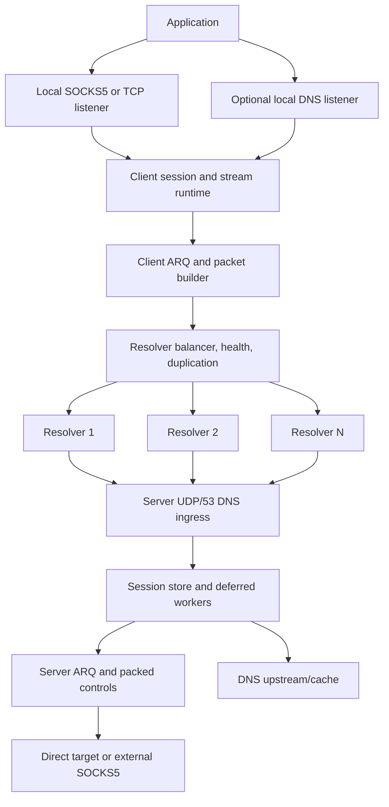
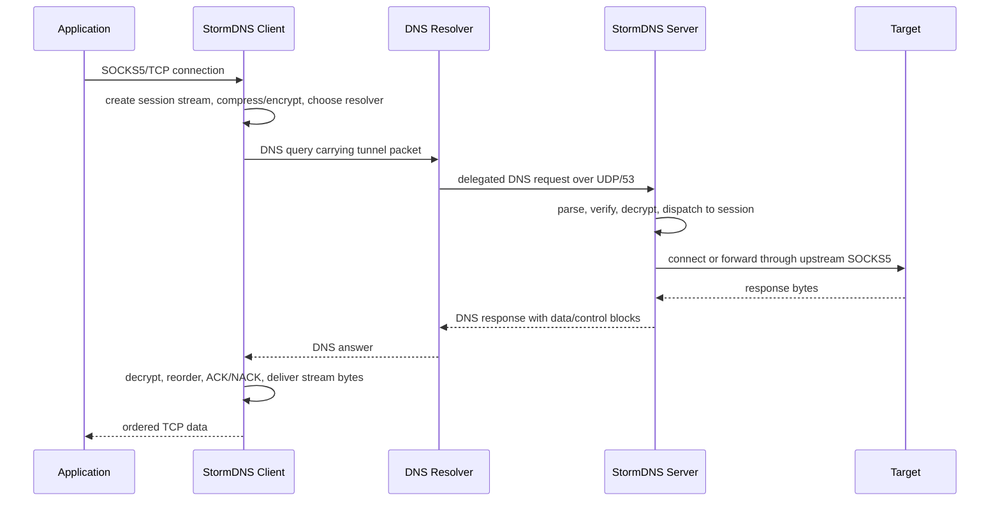

<h1 align="center">⚡ StormDNS</h1>

<p align="center">
  <strong>تونل TCP مبتنی بر DNS برای شبکه‌های فیلترشده، پر packet loss و پر latency.</strong>
</p>

<p align="center">
  <a href="LICENSE"></a>
  
  
  
</p>

<p align="center">
  <a href="README.MD">English</a> ·
  <a href="docs/API.md">HTTP API</a> ·
  <a href="https://github.com/nullroute1970/StormDNS/releases/latest">آخرین Release</a> ·
  <a href="https://t.me/nulllroute1970">کانال تلگرام</a>
</p>

StormDNS یک سیستم تونل client/server است که ترافیک TCP را از طریق پرس‌وجوها و
پاسخ‌های DNS جابه‌جا می‌کند. کلاینت روی دستگاه کاربر اجرا می‌شود و یک پراکسی
محلی SOCKS5/SOCKS4-style در اختیار برنامه‌ها قرار می‌دهد. برنامه‌ها مثل یک
پراکسی معمولی به این listener محلی وصل می‌شوند. سپس StormDNS stream را به
packetهای کوچک و سازگار با DNS تقسیم می‌کند، در صورت نیاز compression و
encryption اعمال می‌کند، packetها را از طریق یک یا چند DNS resolver عمومی
می‌فرستد و در سمت سرور StormDNS دوباره stream را بازسازی می‌کند. سرور در پایان
اتصال واقعی به مقصد را مستقیم یا از طریق SOCKS5 upstream اختیاری برقرار
می‌کند.

این پروژه برای شبکه‌هایی ساخته شده که پروتکل‌های رایج دورزدن محدودیت در آن‌ها
مسدود، کند، active-probe یا ناپایدار می‌شوند، اما مسیر DNS هنوز قابل استفاده
است. چنین شبکه‌هایی معمولاً محدودیت شدید payload در resolverها، latency بالا،
رفتار ناپایدار resolver، upload ضعیف و packet loss زیاد دارند. StormDNS این
شرایط را حالت عادی فرض می‌کند: MTU discovery، health check resolverها،
multi-resolver balancing، packet duplication، ARQ retransmission، ACK/NACK،
packet packing و شروع سریع از logهای sessionهای قبلی برای زنده نگه داشتن تونل
در چنین شبکه‌هایی استفاده می‌شوند.

سناریوی معمول استفاده ساده است: سرور را روی یک VPS با UDP/53 قابل دسترسی اجرا
کنید، یک subdomain کوتاه DNS را به آن سرور delegate کنید، کلید تولیدشده و
domain را داخل config کلاینت بگذارید، resolverهای سالم را اضافه کنید و سپس
مرورگر یا برنامه را به SOCKS5 listener محلی وصل کنید. در راه‌اندازی‌های
پیشرفته‌تر می‌توانید DNS محلی، تنظیمات resolver/MTU، HTTP API محلی برای
monitoring یا عبور خروجی سرور از SOCKS5 خارجی را فعال کنید.

> [!NOTE]
> DNS tunneling با محدودیت اندازه payload، رفتار resolverها، latency، rate
> limit و packet loss روبه‌رو است. هدف StormDNS اتصال قابل استفاده در شرایط
> سخت است، نه ادعای benchmark غیرواقعی یا جایگزینی یک VPN معمولی روی شبکه‌های
> تمیز و پرسرعت.

## 💸 حمایت مالی

حمایت مالی اختیاری است. اگر می‌خواهید از توسعه ادامه‌دار پروژه حمایت کنید، از
یکی از آدرس‌های زیر استفاده کنید:

| 💰 شبکه | 🔐 آدرس |
| --- | --- |
| TON | `UQDfjVk2UdpiMg-bsxqoLa0O_icuaF20D-wWJgIJwK1Ha2Ul` |
| USDT Tron (TRC20) | `TR8ibZGKutPKoDm5nMbHFwGPFBuMKwjG6j` |
| USDT BNB Smart Chain (BEP20) | `0x8c45d6bae8a5a572b2a776779fe0bcae3d3f9107` |

## 🧭 دسترسی سریع

| بخش | لینک |
| --- | --- |
| 🚀 اولین راه‌اندازی | [نصب سریع سرور](#quick-server-setup)، [راه‌اندازی کلاینت](#client-setup) |
| 🌐 نیازمندی دامنه و resolver | [نیازمندی‌های شبکه و دامنه](#network-domain-requirements) |
| ⚙️ تنظیمات | [نمای کلی config](#configuration-overview) |
| 📡 تنظیم resolver و MTU | [تنظیم resolver و MTU](#resolver-mtu-tuning) |
| 🧯 حل مشکل | [عیب‌یابی](#troubleshooting) |
| 🧑‍💻 توسعه | [اجرا از سورس](#running-from-source)، [تست](#testing) |

## 🎯 طراحی‌شده برای شبکه‌های سخت

| واقعیت شبکه | پاسخ StormDNS |
| --- | --- |
| 📏 payload در DNS کوچک است | سربار کم پروتکل، encoding امن برای DNS، کشف فعال MTU |
| 📉 packet loss عادی است | ARQ، ACK/NACK، تایمر retransmission و terminal drain |
| 📡 resolverها کند یا از دسترس خارج می‌شوند | health check، auto-disable، recheck پس‌زمینه و stream failover |
| ⬆️ upload معمولاً گلوگاه است | duplication جداگانه برای upload data، ACK، setup و control |
| 🕒 startup ممکن است زمان‌بر باشد | resolver cache log و شروع سریع از logهای قبلی |

## ✨ قابلیت‌های اصلی

| دسته | قابلیت‌ها |
| --- | --- |
| 🌐 Transport | تونل DNS روی UDP/53، چند domain، مسیریابی روی چند resolver |
| 🧦 دسترسی محلی | SOCKS5 proxy، پردازش SOCKS4-style، حالت raw TCP forwarding |
| 📡 Resolver runtime | random، round-robin، least-loss و lowest-latency |
| 🔁 Reliability | ARQ، ACK/NACK، RTO، retry limit، stream cleanup و packed controls |
| 📦 Efficiency | کشف MTU، packet packing، base encoding اختیاری، ZSTD/LZ4/ZLIB |
| 🔐 Security | None، XOR، ChaCha20، AES-128-GCM، AES-192-GCM، AES-256-GCM |
| 📛 DNS features | DNS listener/cache محلی و DNS upstream/cache سمت سرور |
| 🔎 Operations | HTTP API محلی، installerهای systemd و releaseهای چندسکویی |

## 🗂️ ساختار مخزن

| مسیر | کاربرد |
| --- | --- |
| `cmd/client` | نقطه شروع فایل اجرایی کلاینت |
| `cmd/server` | نقطه شروع فایل اجرایی سرور |
| `internal/client` | runtime کلاینت، SOCKS/TCP listener، balancer، MTU و API |
| `internal/udpserver` | runtime سرور، DNS ingress، sessionها، streamها و workerها |
| `internal/vpnproto` | ساخت، parse و packing packetهای StormDNS |
| `internal/arq` | منطق reliability، retransmission و ACK/NACK |
| `internal/security` | codecهای رمزنگاری و ساخت کلید سرور |
| `internal/compression` | اتصال ZSTD، LZ4 و ZLIB |
| `internal/basecodec` | encoding امن برای DNS |
| `internal/config` | بارگذاری TOML و overrideهای command-line |
| `internal/dnsparser` | parse و ساخت پاسخ DNS |
| `docs/API.md` | مستندات HTTP API کلاینت |
| `scripts/bench` | ابزار benchmark/integration محلی |

<a id="network-domain-requirements"></a>

## 🌐 نیازمندی‌های شبکه و دامنه

برای راه‌اندازی به این موارد نیاز دارید:

- یک سرور با IPv4 عمومی.
- در دسترس بودن UDP port `53` از سمت resolverهای عمومی.
- یک domain یا subdomain که بتوانید آن را به سرور delegate کنید.
- فایل `client_resolvers.txt` در سمت کلاینت.
- کلید رمزنگاری تولیدشده توسط سرور، کپی‌شده داخل `client_config.toml`.

### 🧩 تنظیم DNS و delegation

یک رکورد `A` برای nameserver بسازید و سپس یک رکورد `NS` برای واگذاری subdomain
تونل به آن nameserver اضافه کنید.

مثال:

```text
ns.example.com  A   1.2.3.4
v.example.com   NS  ns.example.com
```

نام delegateشده، مثل `v.example.com`، باید هم در سرور و هم در کلاینت تنظیم شود:

```toml
# server_config.toml
DOMAIN = ["v.example.com"]

# client_config.toml
DOMAINS = ["v.example.com"]
```

اگر دامنه روی Cloudflare است، رکورد `A` مربوط به `ns.example.com` باید روی
**DNS only** باشد و نباید proxied شود.

نام‌های کوتاه بهترند. هر کاراکتر اضافه در query name فضای payload تونل را کم
می‌کند.

<a id="quick-server-setup"></a>

## 🚀 نصب سریع سرور روی Linux

روی سرور لینوکسی اجرا کنید:

```bash
bash <(curl -Ls https://raw.githubusercontent.com/nullroute1970/StormDNS/main/server_linux_install.sh)
```

اسکریپت نصب این کارها را انجام می‌دهد:

- دانلود artifact مناسب، مگر اینکه `--local` استفاده شود؛
- آماده‌سازی `server_config.toml`؛
- پرسیدن domain تونل اگر مقدار نمونه هنوز وجود داشته باشد؛
- آزادسازی port `53` در صورت امکان؛
- باز کردن firewall برای port `53`؛
- اعمال tuning برای UDP و file descriptor؛
- اجرای موقت سرور برای تولید `encrypt_key.txt`؛
- نصب service با نام `stormdns`؛
- نصب egress filter برای reject کردن outbound TCP/53 از سمت سرور.

گزینه‌های installer:

| گزینه | توضیح |
| --- | --- |
| `--version <TAG>` | نصب یک release tag مشخص به جای latest |
| `--local` | استفاده از binary/config محلی از پوشه جاری یا `dist/` |
| `--uninstall` | حذف service، tuningها، binary، config و key از پوشه نصب |
| `--help` | نمایش راهنمای installer |

دستورهای مفید service:

```bash
systemctl status stormdns
journalctl -u stormdns -f
systemctl restart stormdns
systemctl stop stormdns
```

سرور هنگام startup کلید فعال را نمایش می‌دهد و آن را در `encrypt_key.txt` ذخیره
می‌کند. این مقدار را داخل config کلاینت قرار دهید.

<a id="client-setup"></a>

## 🧑‍💻 راه‌اندازی کلاینت

release مناسب سیستم خود را از این صفحه دریافت کنید:

```text
https://github.com/nullroute1970/StormDNS/releases/latest
```

archiveهای کلاینت معمولاً شامل این فایل‌ها هستند:

- فایل اجرایی کلاینت؛
- `client_config.toml`؛
- `client_resolvers.txt`؛
- در Linux، فایل `client_linux_install.sh`.

حداقل تغییرات لازم در کلاینت:

```toml
DOMAINS = ["v.example.com"]
DATA_ENCRYPTION_METHOD = 1
ENCRYPTION_KEY = "paste-server-key-here"

PROTOCOL_TYPE = "SOCKS5"
LISTEN_IP = "127.0.0.1"
LISTEN_PORT = 18000
```

resolverها را خط به خط داخل `client_resolvers.txt` قرار دهید:

```text
8.8.8.8
1.1.1.1:53
9.9.9.9
192.0.2.0/30
[2001:4860:4860::8888]:53
```

اجرای دستی در Linux:

```bash
./StormDNS_Client_Linux_AMD64 --config client_config.toml
```

نمونه Windows:

```powershell
.\StormDNS_Client_Windows_AMD64.exe --config client_config.toml
```

سپس در مرورگر یا برنامه خود proxy را روی این مقدار بگذارید:

```text
SOCKS5 127.0.0.1:18000
```

### 🐧 نصب service کلاینت روی Linux

از داخل پوشه extractشده release کلاینت:

```bash
sudo bash client_linux_install.sh
```

نام service برابر `stormdns-client` است:

```bash
systemctl status stormdns-client
journalctl -u stormdns-client -f
systemctl restart stormdns-client
```

<a id="running-from-source"></a>

## 🛠️ اجرا از سورس

نیازمندی‌ها:

- Go `1.25` طبق `go.mod`.
- Git.
- Python فقط برای زمانی که می‌خواهید از `build.py` استفاده کنید.

ساخت برای سیستم فعلی:

```bash
go build ./cmd/client
go build ./cmd/server
```

اجرای binaryهای ساخته‌شده:

```bash
./client --config client_config.toml
./server --config server_config.toml
```

ساخت یک مجموعه محلی در `dist/`:

```bash
python build.py
```

اسکریپت local build چند target محدود را می‌سازد و configهای نمونه را داخل
`dist/` می‌گذارد. release workflow گیت‌هاب matrix بزرگ‌تری برای Windows،
Linux، Linux-Legacy، macOS و Termux/Android می‌سازد.

<a id="configuration-overview"></a>

## ⚙️ نمای کلی config

StormDNS فقط از فایل‌های TOML استفاده می‌کند. مسیر config به‌صورت پیش‌فرض نسبت
به فایل اجرایی resolve می‌شود.

### 🔐 identity و security مشترک

این مقادیر باید بین کلاینت و سرور هماهنگ باشند:

| تنظیم | کلاینت | سرور | توضیح |
| --- | --- | --- | --- |
| دامنه تونل | `DOMAINS` | `DOMAIN` | همه دامنه‌ها باید به همان سرور delegate شوند |
| روش رمزنگاری | `DATA_ENCRYPTION_METHOD` | `DATA_ENCRYPTION_METHOD` | ID روش باید یکی باشد |
| کلید | `ENCRYPTION_KEY` | `ENCRYPTION_KEY_FILE` | سرور کلید را داخل فایل نگه می‌دارد |

IDهای رمزنگاری:

| ID | روش |
| --- | --- |
| `0` | None |
| `1` | XOR |
| `2` | ChaCha20 |
| `3` | AES-128-GCM |
| `4` | AES-192-GCM |
| `5` | AES-256-GCM |

از `0` فقط برای تست محلی استفاده کنید. `1` سربار کمی دارد، اما امنیت آن ضعیف
است. اگر مسیر تحمل سربار بیشتر را دارد، ChaCha20 یا AES-GCM انتخاب‌های بهتری
هستند.

### 🖥️ تنظیمات مهم کلاینت

| بخش | تنظیمات |
| --- | --- |
| پراکسی محلی | `PROTOCOL_TYPE`, `LISTEN_IP`, `LISTEN_PORT`, `SOCKS5_AUTH` |
| DNS محلی | `LOCAL_DNS_ENABLED`, `LOCAL_DNS_IP`, `LOCAL_DNS_PORT` و cache settings |
| انتخاب resolver | `RESOLVER_BALANCING_STRATEGY` |
| duplication | `UPLOAD_PACKET_DUPLICATION_COUNT`, `DOWNLOAD_PACKET_DUPLICATION_COUNT` و setup duplication |
| health check | `AUTO_DISABLE_TIMEOUT_SERVERS`, `RECHECK_INACTIVE_SERVERS_ENABLED` |
| compression | `UPLOAD_COMPRESSION_TYPE`, `DOWNLOAD_COMPRESSION_TYPE`, `COMPRESSION_MIN_SIZE` |
| MTU | `MIN_UPLOAD_MTU`, `MAX_UPLOAD_MTU`, `MIN_DOWNLOAD_MTU`, `MAX_DOWNLOAD_MTU` |
| startup | `STARTUP_MODE`, `LOG_SCAN_MAX_DAYS`, `LOG_SCAN_MAX_RESOLVERS`, `LOG_BASED_MTU_VERIFY` |
| API | `API_ENABLED`, `API_LISTEN_ADDRESS`, `API_LISTEN_PORT` |

حالت‌های startup:

| مقدار | رفتار |
| --- | --- |
| `ask` | سؤال تعاملی برای اسکن resolverها یا استفاده از log |
| `resolvers` | همیشه اسکن کامل از `client_resolvers.txt` |
| `logs` | شروع از resolver cache log و fallback به اسکن کامل در صورت نیاز |

### 🧠 تنظیمات مهم سرور

| بخش | تنظیمات |
| --- | --- |
| domain policy | `DOMAIN`, `PROTOCOL_TYPE`, supported compression lists |
| UDP listener | `UDP_HOST`, `UDP_PORT`, `UDP_READERS`, `DNS_REQUEST_WORKERS` |
| capacity | `MAX_CONCURRENT_REQUESTS`, `SOCKET_BUFFER_SIZE`, `MAX_PACKET_SIZE` |
| deferred runtime | `DEFERRED_SESSION_WORKERS`, `DEFERRED_SESSION_QUEUE_LIMIT` |
| session lifetime | `SESSION_TIMEOUT_SECONDS` و cleanup/retention settings |
| DNS upstream | `DNS_UPSTREAM_SERVERS` و cache/fragment settings |
| outbound path | `USE_EXTERNAL_SOCKS5`, `FORWARD_IP`, `FORWARD_PORT`, `SOCKS5_AUTH` |
| ARQ | window، RTO، retry، TTL، NACK و terminal drain |
| stream limits | `MAX_STREAMS_PER_SESSION`, `MAX_DNS_RESPONSE_BYTES` |

<a id="resolver-mtu-tuning"></a>

## 📡 تنظیم resolver و MTU

کیفیت resolver تعیین می‌کند تونل واقعاً قابل استفاده هست یا نه. ممکن است یک
resolver برای DNS معمولی خوب باشد، اما برای payload بزرگ، label طولانی یا
درخواست‌های تکراری تونل مناسب نباشد. اجازه دهید کلاینت resolverها را تست کند.

مسیر عملی:

1. با sample config شروع کنید.
2. تعداد زیادی resolver candidate داخل `client_resolvers.txt` بگذارید.
3. با `STARTUP_MODE = "resolvers"` اجرا کنید.
4. `LOG_TO_FILE = true` را روشن نگه دارید تا نتیجه resolver/MTU ذخیره شود.
5. بعد از یک session موفق، برای startup سریع‌تر از `STARTUP_MODE = "logs"`
   استفاده کنید.

اگر startup طولانی است، بازه MTU را کوچک‌تر کنید:

```toml
MIN_UPLOAD_MTU = 80
MAX_UPLOAD_MTU = 180
MIN_DOWNLOAD_MTU = 700
MAX_DOWNLOAD_MTU = 2500
```

اگر resolverهای زیادی fail می‌شوند، حداقل MTU را پایین بیاورید. اگر تونل
پایدار ولی کند است، maximumها را کم‌کم بالا ببرید و دوباره تست کنید.

برای اسکن resolverها می‌توانید از probe کوچک و parallelism بالا استفاده کنید:

```toml
STARTUP_MODE = "resolvers"
MIN_UPLOAD_MTU = 30
MAX_UPLOAD_MTU = 30
MIN_DOWNLOAD_MTU = 40
MAX_DOWNLOAD_MTU = 40
MTU_TEST_RETRIES_RESOLVERS = 1
MTU_TEST_TIMEOUT_RESOLVERS = 1.0
MTU_TEST_PARALLELISM_RESOLVERS = 200
```

قبل از اسکن باید domain و key سرور درست تنظیم شده باشند، چون تست MTU مسیر
واقعی تونل را امتحان می‌کند.

## 📦 راهنمای duplication و compression

duplication احتمال رسیدن packet را بالا می‌برد، اما تعداد DNS queryها را هم
زیاد می‌کند.

پروفایل معمول برای شبکه lossy:

```toml
UPLOAD_PACKET_DUPLICATION_COUNT = 1
DOWNLOAD_PACKET_DUPLICATION_COUNT = 4
UPLOAD_SETUP_PACKET_DUPLICATION_COUNT = 2
DOWNLOAD_SETUP_PACKET_DUPLICATION_COUNT = 4
```

اگر upload بسیار ضعیف است، duplication داده upload را پایین نگه دارید.
duplication مربوط به ACKهای download و control معمولاً هزینه کمتری دارد چون
packetهای کوچکی هستند.

IDهای compression:

| ID | روش |
| --- | --- |
| `0` | OFF |
| `1` | ZSTD |
| `2` | LZ4 |
| `3` | ZLIB |

LZ4 معمولاً انتخاب عملی خوبی برای دستگاه‌های ضعیف و شبکه ناپایدار است. ZSTD
در داده‌های قابل فشرده‌سازی کاهش بیشتری می‌دهد، اما CPU بیشتری مصرف می‌کند.
compression برای ترافیک‌هایی که از قبل فشرده‌اند، مثل بیشتر ویدئوها، archiveها
و payloadهای HTTPS مدرن، کمک زیادی نمی‌کند.

## 🔎 HTTP API محلی

کلاینت می‌تواند API محلی ارائه کند:

```toml
API_ENABLED = true
API_LISTEN_ADDRESS = "127.0.0.1"
API_LISTEN_PORT = 9157
```

نمونه‌ها:

```bash
curl http://127.0.0.1:9157/api/v1/status
curl http://127.0.0.1:9157/api/v1/resolvers
curl -X POST http://127.0.0.1:9157/api/v1/restart-session
```

مستندات کامل در [docs/API.md](docs/API.md) قرار دارد.

API را روی `127.0.0.1` نگه دارید مگر اینکه عمداً بخواهید آن را روی LAN قابل
دسترسی کنید. این API endpointهای کنترلی دارد و authentication داخلی ندارد.

## 📱 استفاده روی موبایل

در این مخزن اپلیکیشن رسمی موبایل وجود ندارد.

روش‌های قابل استفاده:

- کلاینت را روی کامپیوتر اجرا کنید و `LISTEN_IP = "0.0.0.0"` بگذارید تا گوشی
  روی همان LAN از SOCKS5 آن استفاده کند.
- کلاینت را روی یک VPS کوچک یا router اجرا کنید و موبایل‌ها را به SOCKS5 آن
  وصل کنید.
- خروجی یک proxy/panel دیگر را به SOCKS5 محلی StormDNS بدهید.

اگر کلاینت را روی `0.0.0.0` bind می‌کنید، احراز هویت SOCKS5 را فعال کنید:

```toml
SOCKS5_AUTH = true
SOCKS5_USER = "choose-a-user"
SOCKS5_PASS = "choose-a-strong-password"
```

SOCKS5 بدون رمز را روی اینترنت باز نگذارید.

## 🏗️ معماری



جریان کلی packet:



<a id="troubleshooting"></a>

## 🧯 عیب‌یابی

### 🌐 سرور ترافیک دریافت نمی‌کند

- مطمئن شوید رکورد `NS` زیر دامنه را به nameserver شما delegate کرده است.
- مطمئن شوید host مربوط به nameserver رکورد `A` درست به IP سرور دارد.
- مطمئن شوید DNS provider رکورد `A` nameserver را proxy نکرده است.
- مطمئن شوید UDP port `53` در firewall سرور و پنل provider باز است.
- تست مستقیم:

```bash
dig v.example.com NS
dig @ns.example.com v.example.com A
```

### 🚧 port 53 اشغال است

در بسیاری از سیستم‌های Linux، سرویس `systemd-resolved` روی port `53` گوش
می‌دهد. installer تلاش می‌کند این وضعیت را مدیریت کند. رفع دستی:

```bash
sudo nano /etc/systemd/resolved.conf
```

این مقدار را تنظیم کنید:

```text
DNSStubListener=no
```

سپس:

```bash
sudo systemctl restart systemd-resolved
```

روی یک IP/port فقط یک DNS server می‌تواند همزمان listen کند.

### 🕒 startup کلاینت کند است

- بعد از یک اسکن موفق از `STARTUP_MODE = "logs"` استفاده کنید.
- بازه‌های MTU را کوچک‌تر کنید.
- مقدار `MTU_TEST_RETRIES_RESOLVERS` را کاهش دهید.
- resolverهایی را که همیشه fail می‌شوند از `client_resolvers.txt` حذف کنید.

### 🧊 تونل وصل می‌شود اما سایت‌ها گیر می‌کنند

- upload MTU و download MTU را پایین بیاورید.
- duplication مربوط به download ACK/control را بیشتر کنید.
- برای loss کمتر از `RESOLVER_BALANCING_STRATEGY = 3` استفاده کنید.
- resolverهای بیشتری از شبکه‌های مختلف تست کنید.
- endpoint `/api/v1/resolvers` را بررسی کنید تا مسیرهای timeout-only مشخص شود.

### 🧦 SOCKS روی همان سیستم کار می‌کند اما از دستگاه دیگر نه

- `LISTEN_IP = "0.0.0.0"` بگذارید.
- firewall سیستم کلاینت را برای `LISTEN_PORT` باز کنید.
- SOCKS5 authentication را فعال کنید.
- از روی گوشی یا دستگاه دیگر، IP داخل LAN را بزنید؛ `127.0.0.1` فقط همان
  دستگاه محلی است.

## 🏷️ release و نام artifactها

CI تگ release را با این فرم می‌سازد:

```text
vYYYY.MM.DD.HHMMSS-commithash
```

نام artifactها معمولاً این الگو را دارد:

```text
StormDNS_Client_<Platform>_<ARCH>.zip
StormDNS_Client_<Platform>_<ARCH>.tar.gz
StormDNS_Server_<Platform>_<ARCH>.zip
StormDNS_Server_<Platform>_<ARCH>.tar.gz
```

platformهای release شامل Windows، Linux، Linux-Legacy، MacOS و Termux هستند.
architectureهای پشتیبانی‌شده شامل AMD64/x86/ARM و همچنین برخی targetهای
RISC-V و MIPS لینوکس است که در
[.github/workflows/build-go.yml](.github/workflows/build-go.yml) تعریف شده‌اند.

<a id="testing"></a>

## 🧪 تست

چک‌های استاندارد:

```bash
go test ./...
go vet ./...
```

نمونه‌های هدفمند:

```bash
go test -v -run TestName ./internal/client
go test -race ./internal/client ./internal/udpserver
```

ابزار benchmark:

```bash
go run ./scripts/bench
```

## 🛡️ امنیت و مسئولیت

StormDNS بدون هیچ ضمانتی و به‌صورت as-is ارائه می‌شود. مسئولیت نحوه deploy،
شبکه‌ای که روی آن استفاده می‌کنید و قانونی بودن استفاده در محل زندگی شما با
خود شماست.

نکات عملی امنیتی:

- فایل `encrypt_key.txt` را خصوصی نگه دارید.
- SOCKS5 یا API بدون authentication/محدودیت را در دسترس عموم قرار ندهید.
- برای listenerهای محلی، تا حد ممکن از `127.0.0.1` استفاده کنید.
- در شبکه‌های پر loss، وضعیت resolverها و logها را بررسی کنید.
- چند DNS tunnel مختلف را همزمان روی همان port سرور اجرا نکنید.

## 🤝 مشارکت

گزارش باگ، بهبودهای دقیق عملکردی، اصلاحات پروتکل، تست و بهبود مستندات پذیرفته
می‌شود.

- Issues: <https://github.com/nullroute1970/StormDNS/issues>
- Pull requests: <https://github.com/nullroute1970/StormDNS/pulls>

قبل از ارسال تغییرات کد:

```bash
go test ./...
go vet ./...
```

## 📄 مجوز

StormDNS تحت مجوز MIT منتشر شده است. فایل [LICENSE](LICENSE) را ببینید.

## 👤 نگهدارنده

نگهداری پروژه توسط [nullroute1970](https://github.com/nullroute1970) انجام
می‌شود.

کانال پروژه: <https://t.me/nulllroute1970>
